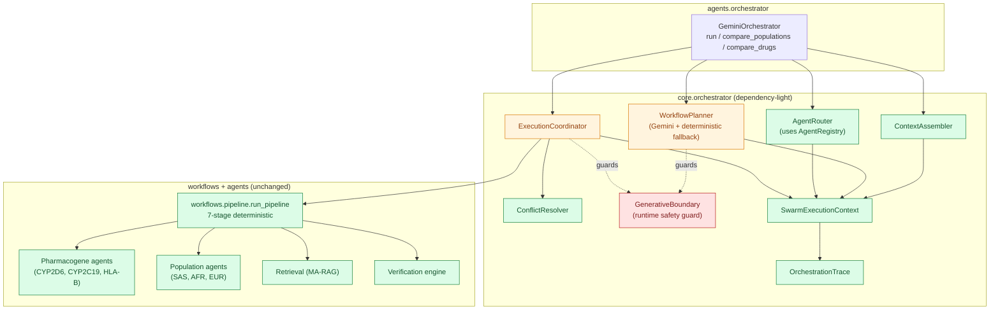
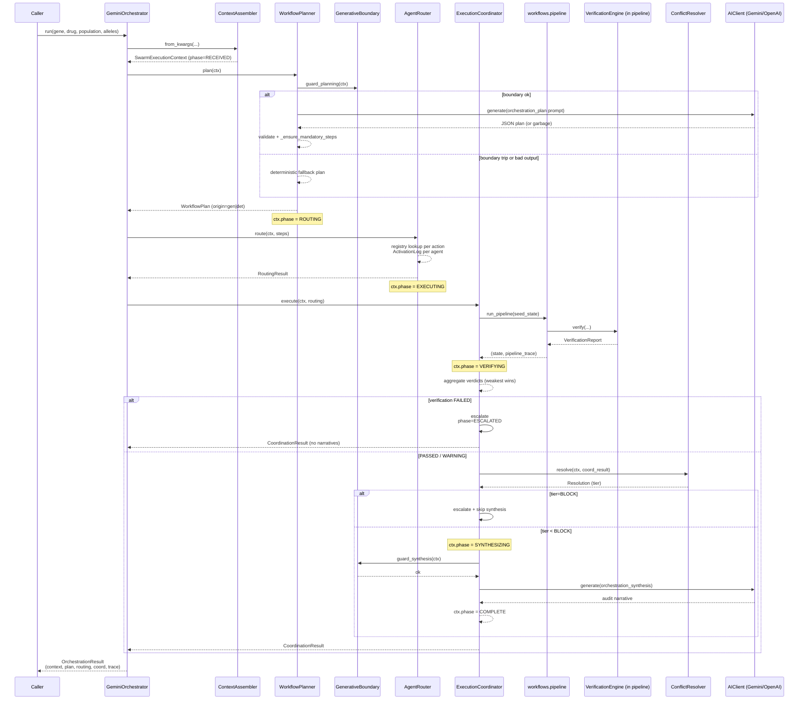
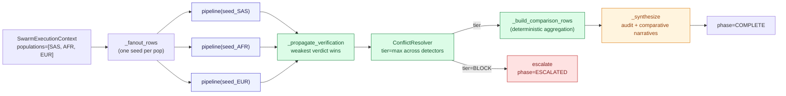
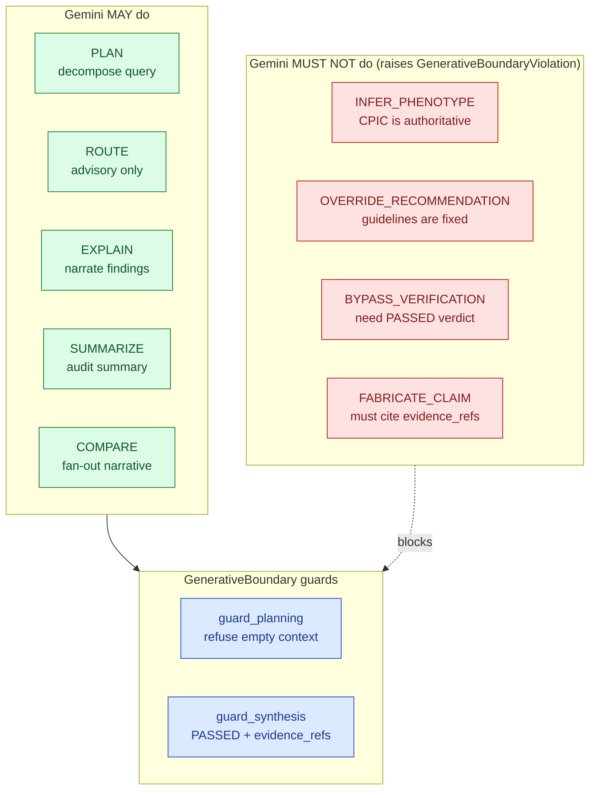
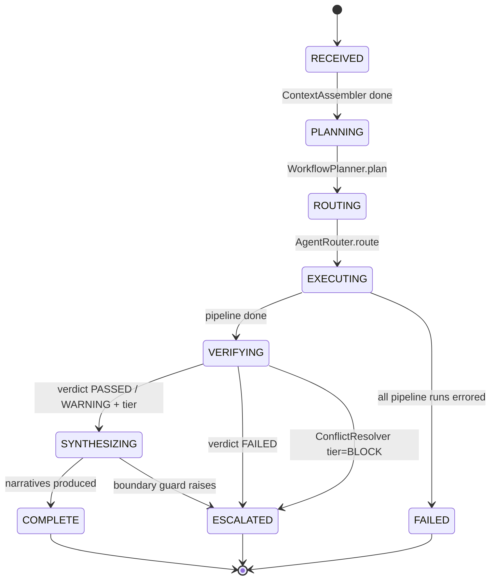

# Gemini Orchestration Flow

> Visualization of the `GeminiOrchestrator` lifecycle. Narrative walkthrough
> lives in [`architecture/gemini-orchestration.md`](../gemini-orchestration.md).

---

## 1. High-level layering

Colour legend:
- **green** — deterministic; same input → same output
- **orange** — uses Gemini via `AIClient` (planner and synthesis only)
- **red**    — safety / boundary enforcement

---

## 2. Single-run lifecycle (`orchestrator.run(...)`)

---

## 3. Comparative fan-out (`compare_populations` / `compare_drugs`)

---

## 4. Deterministic / Generative boundary

---

## 5. Phase state machine

