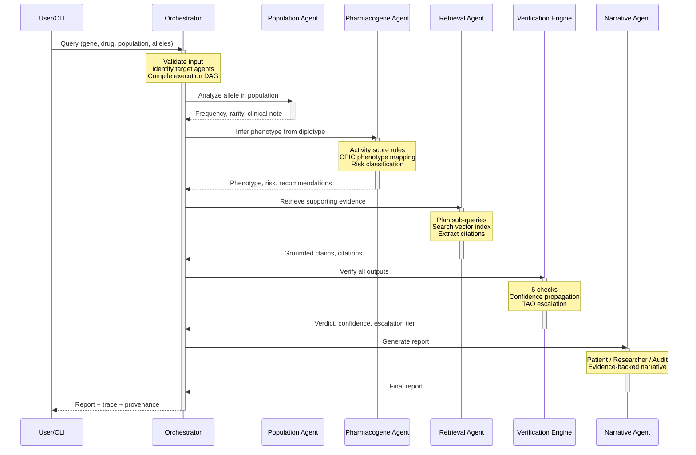
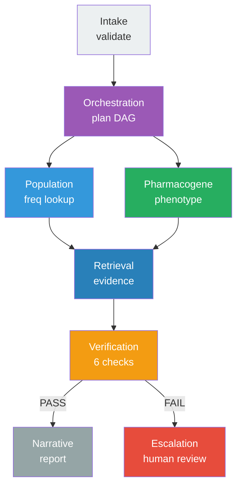

# Orchestration & Pipeline Execution Flow

## 7-Stage Pipeline

```mermaid
flowchart LR
    I[1. Intake] --> O[2. Orchestration] --> P[3. Population] --> PG[4. Pharmacogene] --> R[5. Retrieval] --> V[6. Verification] --> N[7. Narrative]

    style I fill:#ecf0f1
    style O fill:#9b59b6,color:#fff
    style P fill:#3498db,color:#fff
    style PG fill:#27ae60,color:#fff
    style R fill:#2980b9,color:#fff
    style V fill:#f39c12,color:#fff
    style N fill:#95a5a6,color:#fff
```

## Detailed Execution Flow

```mermaid
sequenceDiagram
    participant U as User/CLI
    participant O as Orchestrator
    participant P as Population Agent
    participant PG as Pharmacogene Agent
    participant R as Retrieval Agent
    participant V as Verification Engine
    participant N as Narrative Agent

    U->>O: Query (gene, drug, population, alleles)
    activate O
    Note over O: Validate input<br/>Identify target agents<br/>Compile execution DAG

    O->>P: Analyze allele in population
    activate P
    P-->>O: Frequency, rarity, clinical note
    deactivate P

    O->>PG: Infer phenotype from diplotype
    activate PG
    Note over PG: Activity score rules<br/>CPIC phenotype mapping<br/>Risk classification
    PG-->>O: Phenotype, risk, recommendations
    deactivate PG

    O->>R: Retrieve supporting evidence
    activate R
    Note over R: Plan sub-queries<br/>Search vector index<br/>Extract citations
    R-->>O: Grounded claims, citations
    deactivate R

    O->>V: Verify all outputs
    activate V
    Note over V: 6 checks<br/>Confidence propagation<br/>TAO escalation
    V-->>O: Verdict, confidence, escalation tier
    deactivate V

    O->>N: Generate report
    activate N
    Note over N: Patient / Researcher / Audit<br/>Evidence-backed narrative
    N-->>O: Final report
    deactivate N

    O-->>U: Report + trace + provenance
    deactivate O
```

## DAG Execution Model

```mermaid
graph TD
    INTAKE[Intake<br/>validate] --> ORCH[Orchestration<br/>plan DAG]
    ORCH --> POP[Population<br/>freq lookup]
    ORCH --> PHARM[Pharmacogene<br/>phenotype]
    POP --> RET[Retrieval<br/>evidence]
    PHARM --> RET
    RET --> VER[Verification<br/>6 checks]
    VER -->|PASS| NAR[Narrative<br/>report]
    VER -->|FAIL| ESC[Escalation<br/>human review]

    style INTAKE fill:#ecf0f1
    style ORCH fill:#9b59b6,color:#fff
    style POP fill:#3498db,color:#fff
    style PHARM fill:#27ae60,color:#fff
    style RET fill:#2980b9,color:#fff
    style VER fill:#f39c12,color:#fff
    style NAR fill:#95a5a6,color:#fff
    style ESC fill:#e74c3c,color:#fff
```
