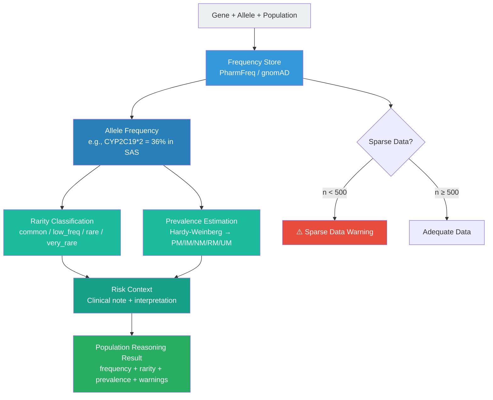
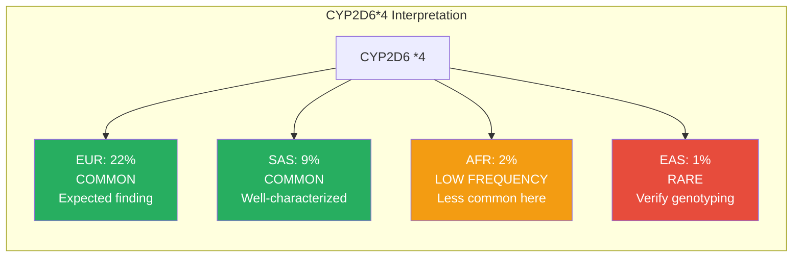
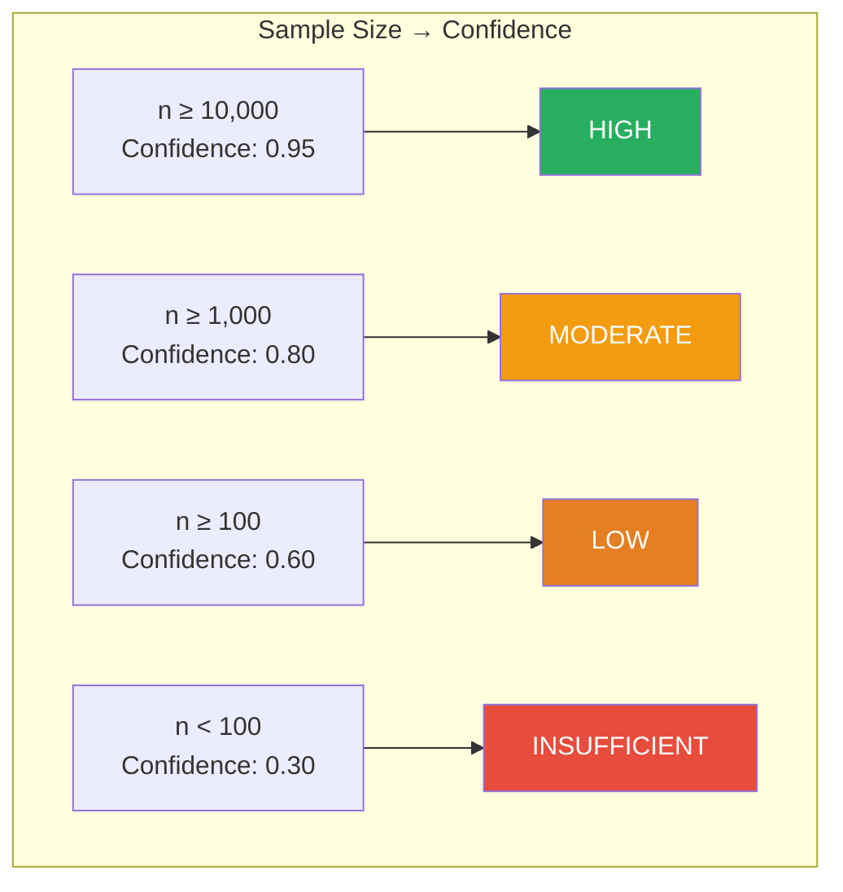
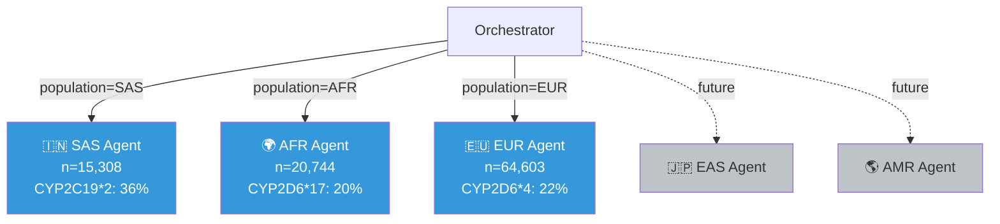

# Population-Aware Reasoning Flow

> "Population is reasoning context, not metadata."

## Population Reasoning Pipeline

## Same Allele, Different Populations

## Confidence Weighting by Sample Size

## Population Agent Fleet

