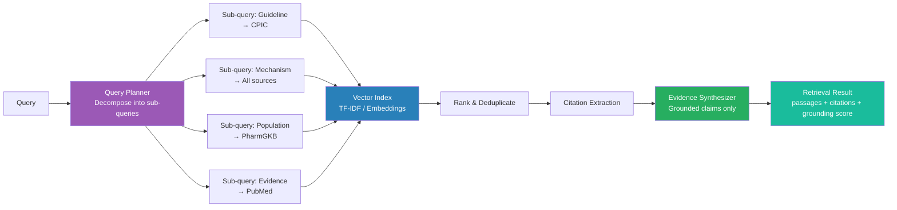
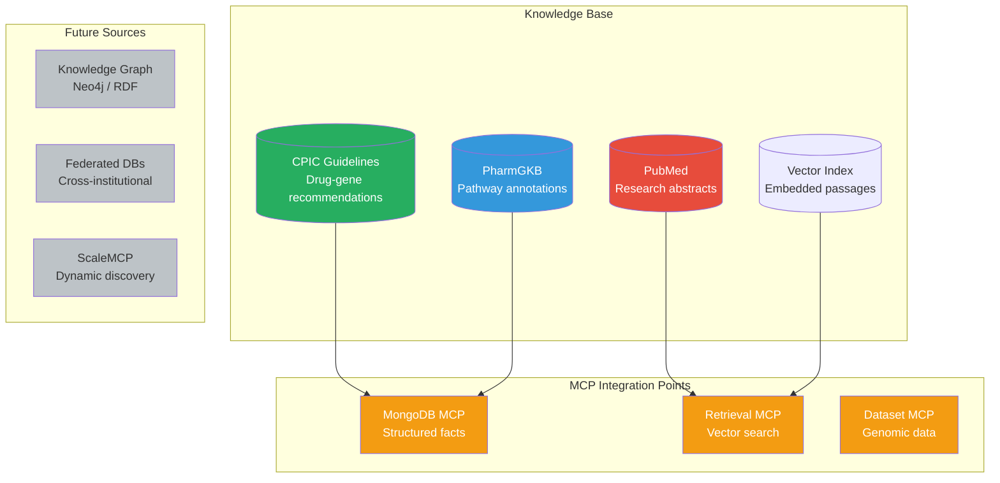
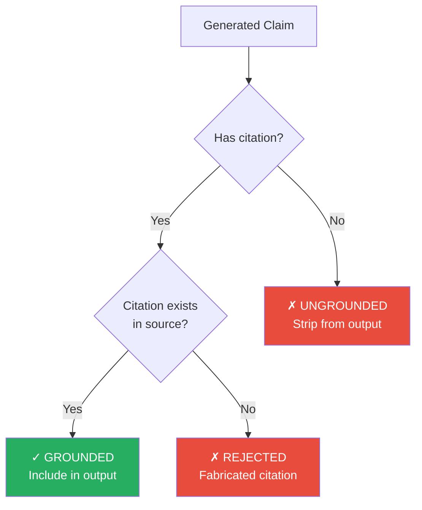
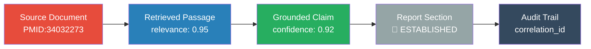

# Retrieval Architecture (MA-RAG + MCP)

## MA-RAG Pipeline

```mermaid
flowchart LR
    Q[Query] --> PLAN[Query Planner<br/>Decompose into sub-queries]
    PLAN --> SQ1[Sub-query: Guideline<br/>→ CPIC]
    PLAN --> SQ2[Sub-query: Mechanism<br/>→ All sources]
    PLAN --> SQ3[Sub-query: Population<br/>→ PharmGKB]
    PLAN --> SQ4[Sub-query: Evidence<br/>→ PubMed]

    SQ1 & SQ2 & SQ3 & SQ4 --> INDEX[Vector Index<br/>TF-IDF / Embeddings]
    INDEX --> RANK[Rank & Deduplicate]
    RANK --> CITE[Citation Extraction]
    CITE --> SYNTH[Evidence Synthesizer<br/>Grounded claims only]
    SYNTH --> OUT[Retrieval Result<br/>passages + citations + grounding score]

    style PLAN fill:#9b59b6,color:#fff
    style INDEX fill:#2980b9,color:#fff
    style SYNTH fill:#27ae60,color:#fff
    style OUT fill:#1abc9c,color:#fff
```

## Document Sources

```mermaid
graph TB
    subgraph "Knowledge Base"
        CPIC[(CPIC Guidelines<br/>Drug-gene recommendations)]
        PGKB[(PharmGKB<br/>Pathway annotations)]
        PM[(PubMed<br/>Research abstracts)]
        VEC[(Vector Index<br/>Embedded passages)]
    end

    subgraph "MCP Integration Points"
        MCP_M[MongoDB MCP<br/>Structured facts]
        MCP_R[Retrieval MCP<br/>Vector search]
        MCP_D[Dataset MCP<br/>Genomic data]
    end

    CPIC --> MCP_M
    PGKB --> MCP_M
    PM --> MCP_R
    VEC --> MCP_R

    subgraph "Future Sources"
        KG[Knowledge Graph<br/>Neo4j / RDF]
        FED[Federated DBs<br/>Cross-institutional]
        SCALE[ScaleMCP<br/>Dynamic discovery]
    end

    style CPIC fill:#27ae60,color:#fff
    style PGKB fill:#3498db,color:#fff
    style PM fill:#e74c3c,color:#fff
    style MCP_M fill:#f39c12,color:#fff
    style MCP_R fill:#f39c12,color:#fff
    style MCP_D fill:#f39c12,color:#fff
    style KG fill:#bdc3c7
    style FED fill:#bdc3c7
    style SCALE fill:#bdc3c7
```

## Grounding Enforcement

```mermaid
flowchart TD
    CLAIM[Generated Claim] --> HAS_CIT{Has citation?}
    HAS_CIT -->|Yes| VALID{Citation exists<br/>in source?}
    VALID -->|Yes| GROUNDED[✓ GROUNDED<br/>Include in output]
    VALID -->|No| REJECT[✗ REJECTED<br/>Fabricated citation]
    HAS_CIT -->|No| UNGROUNDED[✗ UNGROUNDED<br/>Strip from output]

    style GROUNDED fill:#27ae60,color:#fff
    style REJECT fill:#e74c3c,color:#fff
    style UNGROUNDED fill:#e74c3c,color:#fff
```

## Provenance Chain

```mermaid
flowchart LR
    SOURCE[Source Document<br/>PMID:34032273] --> PASSAGE[Retrieved Passage<br/>relevance: 0.95]
    PASSAGE --> CLAIM[Grounded Claim<br/>confidence: 0.92]
    CLAIM --> REPORT[Report Section<br/>🔬 ESTABLISHED]
    REPORT --> AUDIT[Audit Trail<br/>correlation_id]

    style SOURCE fill:#e74c3c,color:#fff
    style PASSAGE fill:#2980b9,color:#fff
    style CLAIM fill:#27ae60,color:#fff
    style REPORT fill:#95a5a6,color:#fff
    style AUDIT fill:#34495e,color:#fff
```
