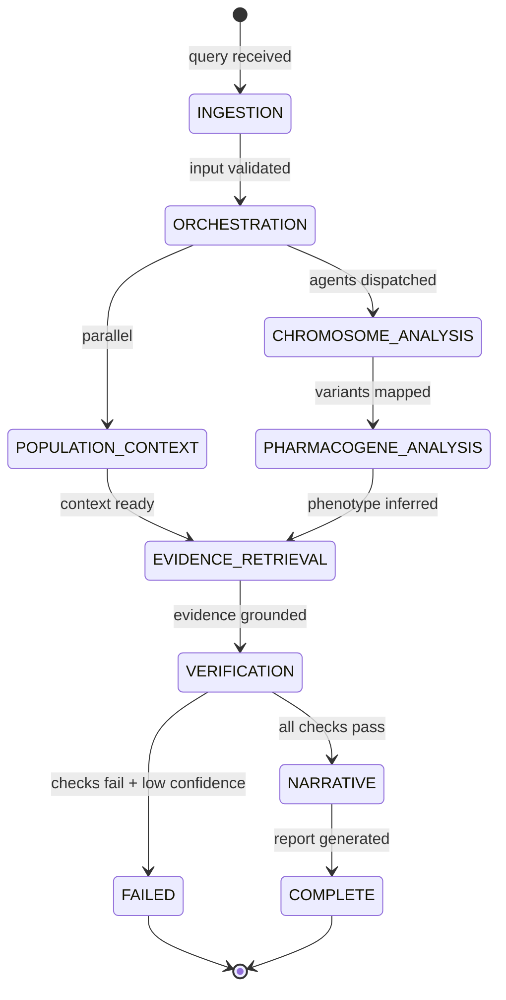
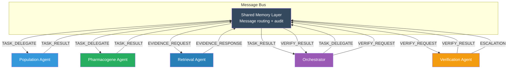
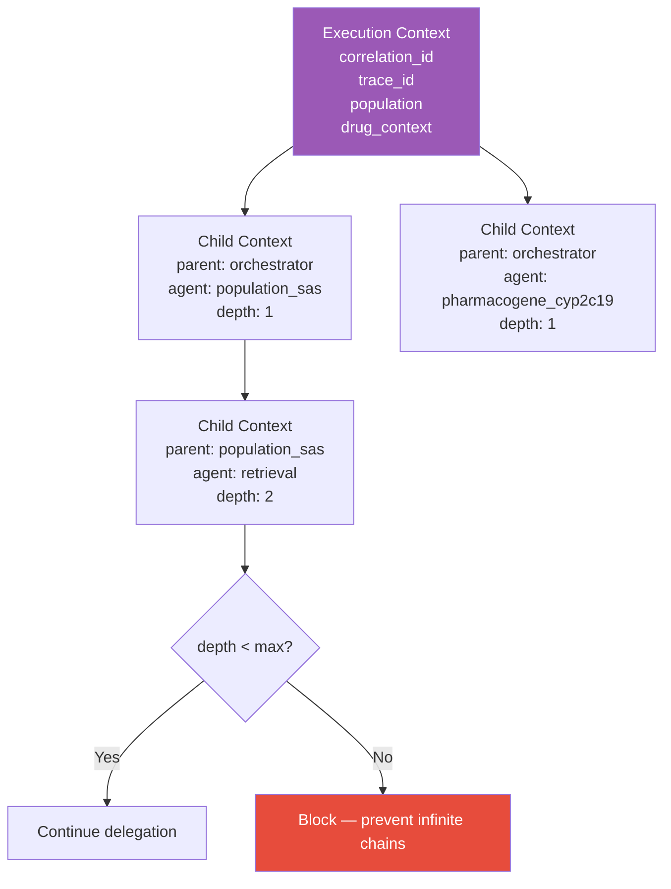
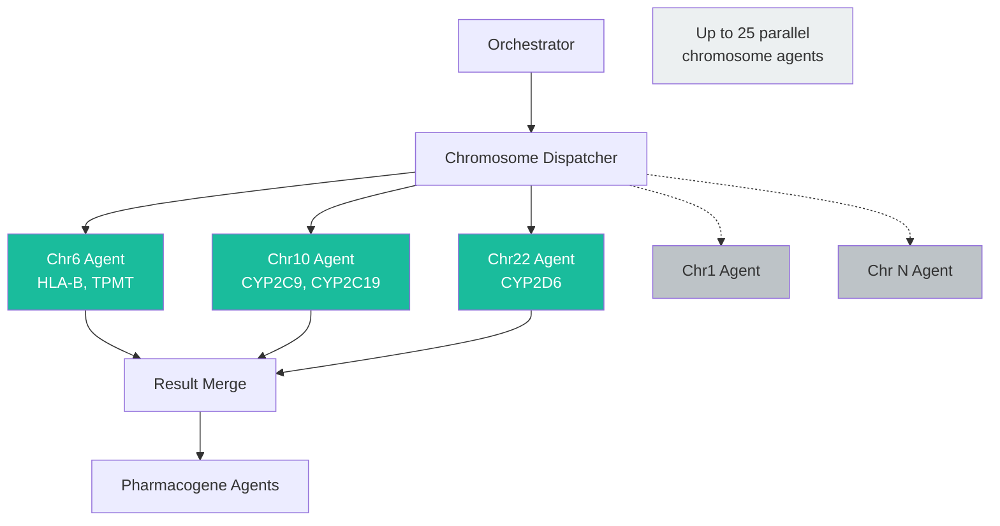

# Execution State & Agent Communication

## Pipeline State Lifecycle

```mermaid
stateDiagram-v2
    [*] --> INGESTION: query received
    INGESTION --> ORCHESTRATION: input validated
    ORCHESTRATION --> CHROMOSOME_ANALYSIS: agents dispatched
    ORCHESTRATION --> POPULATION_CONTEXT: parallel
    CHROMOSOME_ANALYSIS --> PHARMACOGENE_ANALYSIS: variants mapped
    POPULATION_CONTEXT --> EVIDENCE_RETRIEVAL: context ready
    PHARMACOGENE_ANALYSIS --> EVIDENCE_RETRIEVAL: phenotype inferred
    EVIDENCE_RETRIEVAL --> VERIFICATION: evidence grounded
    VERIFICATION --> NARRATIVE: all checks pass
    VERIFICATION --> FAILED: checks fail + low confidence
    NARRATIVE --> COMPLETE: report generated
    FAILED --> [*]
    COMPLETE --> [*]
```

## Agent Communication Topology

```mermaid
graph TD
    subgraph "Message Bus"
        BUS[Shared Memory Layer<br/>Message routing + audit]
    end

    O[Orchestrator] -->|TASK_DELEGATE| BUS
    BUS -->|TASK_DELEGATE| P[Population Agent]
    BUS -->|TASK_DELEGATE| PG[Pharmacogene Agent]
    BUS -->|EVIDENCE_REQUEST| R[Retrieval Agent]

    P -->|TASK_RESULT| BUS
    PG -->|TASK_RESULT| BUS
    R -->|EVIDENCE_RESPONSE| BUS
    BUS -->|TASK_RESULT| O

    O -->|VERIFY_REQUEST| BUS
    BUS -->|VERIFY_REQUEST| V[Verification Agent]
    V -->|VERIFY_RESULT| BUS
    V -->|ESCALATION| BUS
    BUS -->|VERIFY_RESULT| O

    style BUS fill:#34495e,color:#fff
    style O fill:#9b59b6,color:#fff
    style P fill:#3498db,color:#fff
    style PG fill:#27ae60,color:#fff
    style R fill:#2980b9,color:#fff
    style V fill:#f39c12,color:#fff
```

## Execution Context Propagation

```mermaid
flowchart TD
    CTX[Execution Context<br/>correlation_id<br/>trace_id<br/>population<br/>drug_context]

    CTX --> CHILD1[Child Context<br/>parent: orchestrator<br/>agent: population_sas<br/>depth: 1]
    CTX --> CHILD2[Child Context<br/>parent: orchestrator<br/>agent: pharmacogene_cyp2c19<br/>depth: 1]
    CHILD1 --> CHILD3[Child Context<br/>parent: population_sas<br/>agent: retrieval<br/>depth: 2]

    CHILD3 --> LIMIT{depth < max?}
    LIMIT -->|Yes| PROCEED[Continue delegation]
    LIMIT -->|No| STOP[Block — prevent infinite chains]

    style CTX fill:#9b59b6,color:#fff
    style STOP fill:#e74c3c,color:#fff
```

## Future: Chromosome Agent Expansion

```mermaid
graph TB
    ORCH[Orchestrator] --> CHR_DISPATCH[Chromosome Dispatcher]

    CHR_DISPATCH --> CHR6[Chr6 Agent<br/>HLA-B, TPMT]
    CHR_DISPATCH --> CHR10[Chr10 Agent<br/>CYP2C9, CYP2C19]
    CHR_DISPATCH --> CHR22[Chr22 Agent<br/>CYP2D6]
    CHR_DISPATCH -.-> CHR1[Chr1 Agent]
    CHR_DISPATCH -.-> CHR_N[Chr N Agent]

    CHR6 & CHR10 & CHR22 --> MERGE[Result Merge]
    MERGE --> PG[Pharmacogene Agents]

    style CHR6 fill:#1abc9c,color:#fff
    style CHR10 fill:#1abc9c,color:#fff
    style CHR22 fill:#1abc9c,color:#fff
    style CHR1 fill:#bdc3c7
    style CHR_N fill:#bdc3c7

    Note[Up to 25 parallel<br/>chromosome agents]
    style Note fill:#ecf0f1
```
