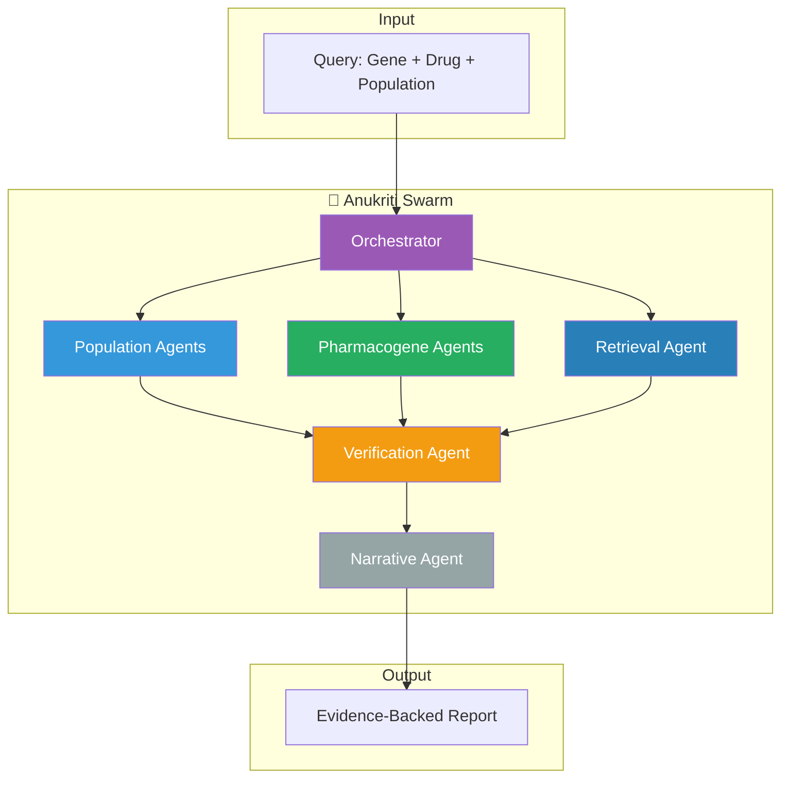
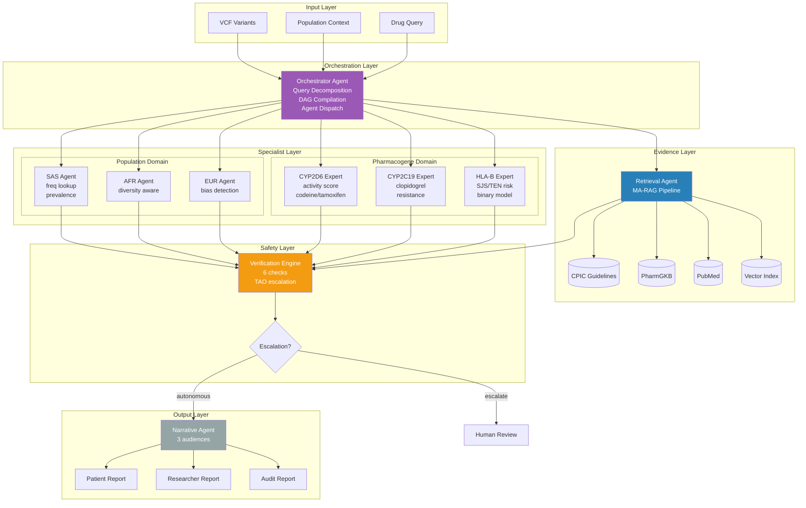
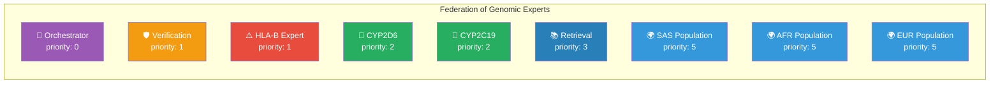

# Swarm Architecture Overview

## Simplified View (for judges/presentations)

```mermaid
graph TB
    subgraph Input
        Q[Query: Gene + Drug + Population]
    end

    subgraph "🧬 Anukriti Swarm"
        O[Orchestrator]
        P[Population Agents]
        PG[Pharmacogene Agents]
        R[Retrieval Agent]
        V[Verification Agent]
        N[Narrative Agent]
    end

    subgraph Output
        Report[Evidence-Backed Report]
    end

    Q --> O
    O --> P
    O --> PG
    O --> R
    P --> V
    PG --> V
    R --> V
    V --> N
    N --> Report

    style O fill:#9b59b6,color:#fff
    style P fill:#3498db,color:#fff
    style PG fill:#27ae60,color:#fff
    style R fill:#2980b9,color:#fff
    style V fill:#f39c12,color:#fff
    style N fill:#95a5a6,color:#fff
```

## Detailed Architecture

```mermaid
graph TB
    subgraph "Input Layer"
        VCF[VCF Variants]
        POP[Population Context]
        DRUG[Drug Query]
    end

    subgraph "Orchestration Layer"
        ORCH[Orchestrator Agent<br/>Query Decomposition<br/>DAG Compilation<br/>Agent Dispatch]
    end

    subgraph "Specialist Layer"
        direction LR
        subgraph "Population Domain"
            SAS[SAS Agent<br/>freq lookup<br/>prevalence]
            AFR[AFR Agent<br/>diversity aware]
            EUR[EUR Agent<br/>bias detection]
        end
        subgraph "Pharmacogene Domain"
            CYP2D6[CYP2D6 Expert<br/>activity score<br/>codeine/tamoxifen]
            CYP2C19[CYP2C19 Expert<br/>clopidogrel<br/>resistance]
            HLAB[HLA-B Expert<br/>SJS/TEN risk<br/>binary model]
        end
    end

    subgraph "Evidence Layer"
        RET[Retrieval Agent<br/>MA-RAG Pipeline]
        CPIC[(CPIC Guidelines)]
        PGKB[(PharmGKB)]
        PM[(PubMed)]
        VDB[(Vector Index)]
    end

    subgraph "Safety Layer"
        VER[Verification Engine<br/>6 checks<br/>TAO escalation]
        ESC{Escalation?}
    end

    subgraph "Output Layer"
        NAR[Narrative Agent<br/>3 audiences]
        PAT[Patient Report]
        RES[Researcher Report]
        AUD[Audit Report]
    end

    VCF --> ORCH
    POP --> ORCH
    DRUG --> ORCH

    ORCH --> SAS & AFR & EUR
    ORCH --> CYP2D6 & CYP2C19 & HLAB
    ORCH --> RET

    RET --> CPIC & PGKB & PM & VDB

    SAS & AFR & EUR --> VER
    CYP2D6 & CYP2C19 & HLAB --> VER
    RET --> VER

    VER --> ESC
    ESC -->|autonomous| NAR
    ESC -->|escalate| HUMAN[Human Review]

    NAR --> PAT & RES & AUD

    style ORCH fill:#9b59b6,color:#fff
    style VER fill:#f39c12,color:#fff
    style RET fill:#2980b9,color:#fff
    style NAR fill:#95a5a6,color:#fff
```

## Agent Registry

```mermaid
graph LR
    subgraph "Federation of Genomic Experts"
        direction TB
        O[🎯 Orchestrator<br/>priority: 0]
        V[🛡️ Verification<br/>priority: 1]
        H[⚠️ HLA-B Expert<br/>priority: 1]
        D6[💊 CYP2D6<br/>priority: 2]
        C19[💊 CYP2C19<br/>priority: 2]
        R[📚 Retrieval<br/>priority: 3]
        S[🌍 SAS Population<br/>priority: 5]
        A[🌍 AFR Population<br/>priority: 5]
        E[🌍 EUR Population<br/>priority: 5]
    end

    style O fill:#9b59b6,color:#fff
    style V fill:#f39c12,color:#fff
    style H fill:#e74c3c,color:#fff
    style D6 fill:#27ae60,color:#fff
    style C19 fill:#27ae60,color:#fff
    style R fill:#2980b9,color:#fff
    style S fill:#3498db,color:#fff
    style A fill:#3498db,color:#fff
    style E fill:#3498db,color:#fff
```
