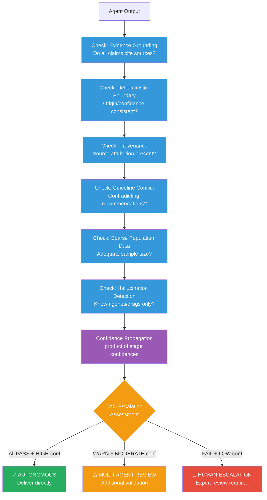
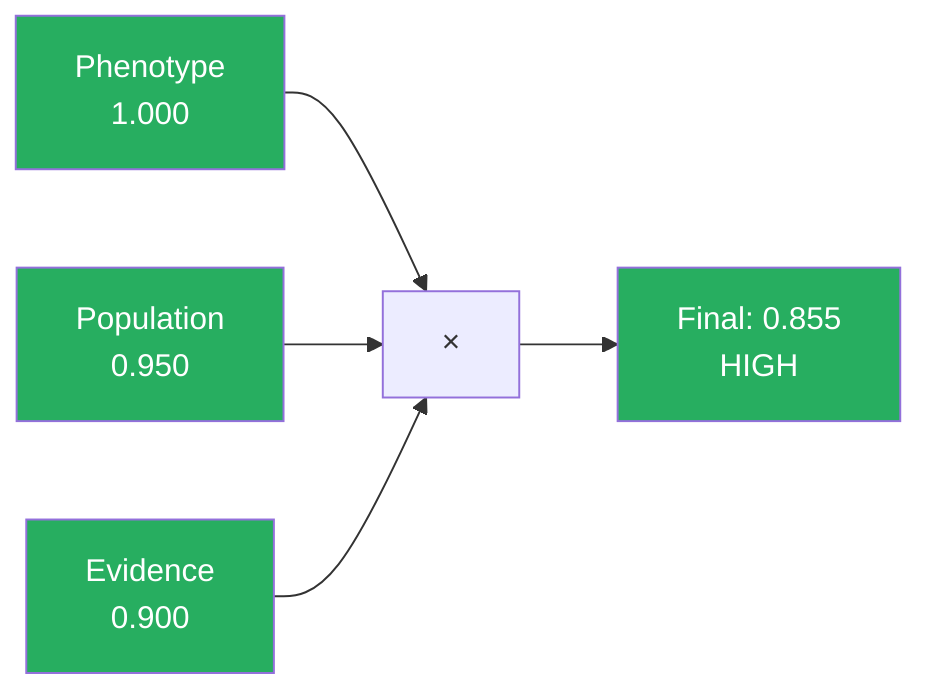
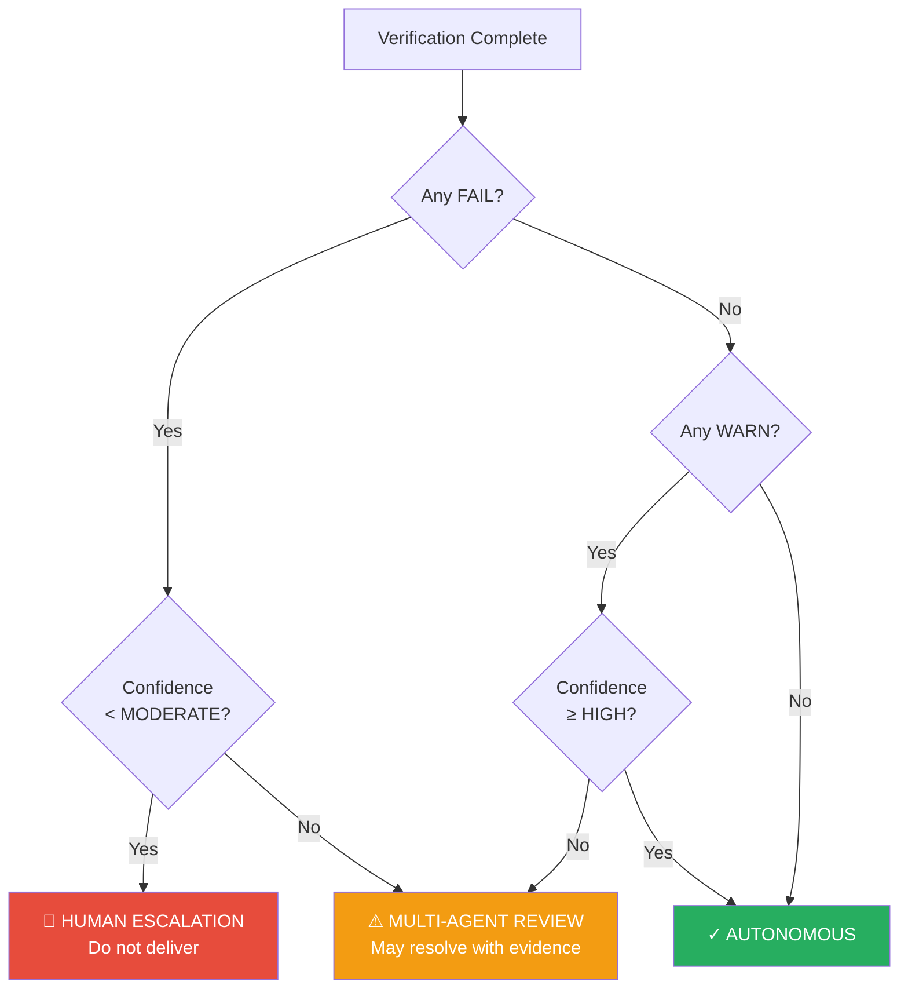
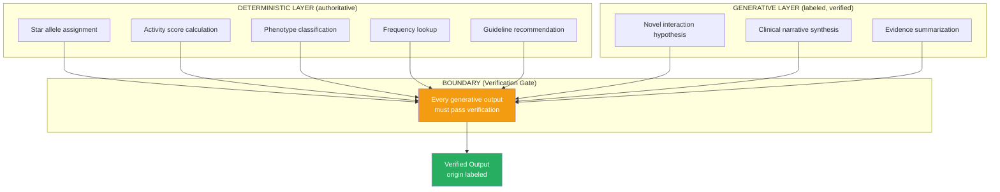

# Verification Pipeline & Escalation

## Verification Engine Flow

```mermaid
flowchart TD
    INPUT[Agent Output] --> C1[Check: Evidence Grounding<br/>Do all claims cite sources?]
    C1 --> C2[Check: Deterministic Boundary<br/>Origin/confidence consistent?]
    C2 --> C3[Check: Provenance<br/>Source attribution present?]
    C3 --> C4[Check: Guideline Conflict<br/>Contradicting recommendations?]
    C4 --> C5[Check: Sparse Population Data<br/>Adequate sample size?]
    C5 --> C6[Check: Hallucination Detection<br/>Known genes/drugs only?]

    C6 --> CONF[Confidence Propagation<br/>product of stage confidences]
    CONF --> TAO{TAO Escalation<br/>Assessment}

    TAO -->|All PASS + HIGH conf| AUTO[✓ AUTONOMOUS<br/>Deliver directly]
    TAO -->|WARN + MODERATE conf| REVIEW[⚠ MULTI-AGENT REVIEW<br/>Additional validation]
    TAO -->|FAIL + LOW conf| HUMAN[🚨 HUMAN ESCALATION<br/>Expert review required]

    style C1 fill:#3498db,color:#fff
    style C2 fill:#3498db,color:#fff
    style C3 fill:#3498db,color:#fff
    style C4 fill:#3498db,color:#fff
    style C5 fill:#3498db,color:#fff
    style C6 fill:#3498db,color:#fff
    style CONF fill:#9b59b6,color:#fff
    style TAO fill:#f39c12,color:#fff
    style AUTO fill:#27ae60,color:#fff
    style REVIEW fill:#f39c12,color:#fff
    style HUMAN fill:#e74c3c,color:#fff
```

## Confidence Propagation

```mermaid
flowchart LR
    P[Phenotype<br/>1.000] --> MUL[×]
    POP[Population<br/>0.950] --> MUL
    EV[Evidence<br/>0.900] --> MUL
    MUL --> FINAL[Final: 0.855<br/>HIGH]

    style P fill:#27ae60,color:#fff
    style POP fill:#27ae60,color:#fff
    style EV fill:#27ae60,color:#fff
    style FINAL fill:#27ae60,color:#fff
```

## TAO Escalation Decision Tree

```mermaid
graph TD
    START[Verification Complete] --> FAIL{Any FAIL?}
    FAIL -->|Yes| CONF_LOW{Confidence<br/>< MODERATE?}
    CONF_LOW -->|Yes| HUMAN[🚨 HUMAN ESCALATION<br/>Do not deliver]
    CONF_LOW -->|No| MULTI[⚠ MULTI-AGENT REVIEW<br/>May resolve with evidence]
    FAIL -->|No| WARN{Any WARN?}
    WARN -->|Yes| CONF_HIGH{Confidence<br/>≥ HIGH?}
    CONF_HIGH -->|No| MULTI
    CONF_HIGH -->|Yes| AUTO[✓ AUTONOMOUS]
    WARN -->|No| AUTO

    style HUMAN fill:#e74c3c,color:#fff
    style MULTI fill:#f39c12,color:#fff
    style AUTO fill:#27ae60,color:#fff
```

## Deterministic vs Generative Boundary

```mermaid
graph TB
    subgraph "DETERMINISTIC LAYER (authoritative)"
        DET1[Star allele assignment]
        DET2[Activity score calculation]
        DET3[Phenotype classification]
        DET4[Frequency lookup]
        DET5[Guideline recommendation]
    end

    subgraph "BOUNDARY (Verification Gate)"
        GATE[Every generative output<br/>must pass verification]
    end

    subgraph "GENERATIVE LAYER (labeled, verified)"
        GEN1[Novel interaction hypothesis]
        GEN2[Clinical narrative synthesis]
        GEN3[Evidence summarization]
    end

    DET1 & DET2 & DET3 & DET4 & DET5 --> GATE
    GEN1 & GEN2 & GEN3 --> GATE
    GATE --> OUTPUT[Verified Output<br/>origin labeled]

    style GATE fill:#f39c12,color:#fff
    style OUTPUT fill:#27ae60,color:#fff
```
