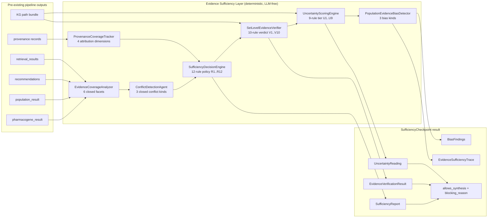

# Evidence Sufficiency Layer — Anukriti Swarm

**Status:** production — evidence-governed genomic intelligence infrastructure shipped.
**Last verified sweep:** 3 canonical + 6 adversarial scenarios produce deterministic outcomes; all four flagship demos (showcase / safety_demo / interoperability_demo / evaluation_demo) produce byte-identical signatures to session #5.

## Scope firewall (read first)

The Evidence Sufficiency Layer is a **governance, safety, and completeness layer** — strictly scoped to pharmacogenomic risk analysis for population-aware pre-clinical-trial reasoning. It is **not**:

- a generic RAG chatbot — inputs are restricted to the `(drug, gene, population, genotype)` tuple
- a document search engine — it wraps `retrieval/` unchanged, never replaces it
- a general biomedical assistant — every public type keys on pharmacogenomic entities (allele / phenotype / CPIC / population)
- a GraphRAG framework — the KG (phase 3) carries only 10 brief-named node kinds
- an LLM-as-judge — sufficiency is computed from evidence counts, facet coverage, and graph paths; never from a model's opinion about the evidence

Every class in `core/evidence_sufficiency/`, `knowledge_graph/`, `retrieval/multi_strategy/`, and `retrieval/stopping/` enforces this firewall through closed enums at the type boundary. Adding an 11th node kind, an 8th edge kind, a 7th evidence facet, a 6th uncertainty tier, or a 4th bias class is a deliberate code change — never runtime configuration.

## Why retrieval relevance alone is insufficient

A traditional RAG pipeline stops when retrieval returns some documents scoring above a relevance threshold. For a clinical-adjacent reasoner this is dangerous:

- **Relevance ≠ coverage.** Retrieved docs may discuss the drug and the gene without ever mentioning the target population; the conclusion would be ancestry-blind.
- **Relevance ≠ non-conflict.** Two relevant docs can contradict each other on phenotype assignment, recommendation action, or allele frequency — a top-k retriever surfaces both without flagging the disagreement.
- **Relevance ≠ attribution.** A relevant passage pulled from an unresolved provenance chain cannot be audited, which means the downstream narrative cannot be safely published.

The Evidence Sufficiency Layer makes each of those three concerns into an explicit **deterministic rule** applied **before** any generative synthesis runs. The question the layer answers is structural, not semantic:

> "For this specific `(drug, gene, population, genotype)` tuple, is the evidence set **jointly** complete, non-contradictory, provenance-complete, and population-representative enough that a synthesis is safe to emit?"

If the answer is not an unambiguous yes, the layer produces one of six explicit refusals (`BLOCK` / `ABSTAIN` / `ESCALATE` / `REQUEST_MORE` / `DOWNGRADE` / `PASS_WITH_CAVEAT`) — each with a rule id naming the reason.

## Architecture

The layer composes four deterministic stacks into a single audit surface:



Every component reads already-produced outputs and applies a pinned rule table. No component re-opens documents, re-runs rules, or calls an LLM.

## The 4 closed rule tables (at a glance)

### SufficiencyDecisionEngine — 12 rules → 7 decisions

```
R1  CONFLICT_FREE MISSING or hard finding  -> BLOCK
R2  PHENOTYPE MISSING                      -> BLOCK
R3  RECOMMENDATION MISSING                 -> BLOCK
R4  provenance incomplete                  -> ABSTAIN
R5  POPULATION MISSING                     -> ESCALATE
R6  CPIC MISSING                           -> REQUEST_MORE
R7  ALLELE MISSING                         -> REQUEST_MORE
R8  RECOMMENDATION UNCERTAIN               -> DOWNGRADE
R9  POPULATION UNCERTAIN                   -> DOWNGRADE
R10 any remaining UNCERTAIN facet          -> DOWNGRADE
R11 CONFLICT_FREE UNCERTAIN (soft only)    -> PASS_WITH_CAVEAT
R12 all covered, no conflict, prov clean   -> SUFFICIENT
```

### SetLevelEvidenceVerifier — 10 rules → 5 verdicts (SURE-RAG-style)

```
V1  named invertor in recommendation clash  -> REFUTED
V2  other hard conflict                     -> CONFLICTING
V3  PHENOTYPE missing                       -> INSUFFICIENT
V4  RECOMMENDATION missing                  -> INSUFFICIENT
V5  other missing facet                     -> INSUFFICIENT
V6  empty KG path bundle supplied           -> UNCERTAIN
V7  POPULATION uncertain                    -> UNCERTAIN
V8  other uncertain facet                   -> UNCERTAIN
V9  CONFLICT_FREE uncertain (soft only)     -> UNCERTAIN
V10 all covered, no hard conflict           -> SUPPORTED
```

### UncertaintyScoringEngine — 9 rules → 4 tiers

```
U1 hard conflict                   -> UNSAFE
U2 missing facet (non-CONFLICT_FREE)-> HIGH
U3 POPULATION uncertain            -> HIGH
U4 empty KG path bundle supplied   -> HIGH
U5 >=2 uncertain facets total      -> HIGH
U6 CONFLICT_FREE uncertain (soft)  -> MODERATE
U7 exactly 1 non-core uncertain    -> MODERATE
U8 KG path bundle with 1 path      -> MODERATE
U9 otherwise                       -> LOW
```

Tier → action mapping (single helper, shared across the layer): `UNSAFE→BLOCK`, `HIGH→REQUEST_MORE`, `MODERATE/LOW→PROCEED`. `ABSTAIN`/`ESCALATE` are reserved for orchestrator composition in phase 6.

### PopulationEvidenceBiasDetector — 3 closed bias kinds

```
EUROCENTRIC_IMBALANCE      target is non-EUR, target evidence=0 while
                           EUR evidence>0 (Eurocentric skew)
ANCESTRY_SCARCITY          target allele count / max <scarcity_ratio
                           (default 0.5) — underrepresentation vs any pop
UNSUPPORTED_EXTRAPOLATION  POPULATION UNCERTAIN AND target has 0 freq
                           data in the KG — reasoning about a population
                           using evidence that doesn't cover it
```

Every finding is a concrete measurement with numeric thresholds; the `measurements` dict on every `BiasFinding` surfaces the raw counts.

## Set-level verification (SURE-RAG adaptation)

The `SetLevelEvidenceVerifier` is the SURE-RAG-inspired move: judge the evidence set **jointly** rather than one claim at a time. Where `BiomedicalClaimValidator` (phase-2 safety engine) operates locally — "does this claim cite something?" — the set-level verifier operates globally — "does the bundle, taken together, support the conclusion?".

The distinction that matters most is **REFUTED vs CONFLICTING**. Both require hard conflicts, but:

- **REFUTED** means we can *name* the refuting signal — specifically, a `RECOMMENDATION_CLASH` with one side classifying as `AVOID`/`CONTRAINDICATED` and the other as `USE`. The layer knows which side is the safety directive and can route accordingly.
- **CONFLICTING** means a hard conflict is present but without a clean invertor — e.g. a `PHENOTYPE_DISAGREEMENT`. The layer refuses to pick a side and escalates.

This separation is why the layer doesn't collapse into a binary pass/fail gate: different refusal modes route to different downstream actions.

## Graph-based genomic reasoning

Population-aware multi-hop reasoning lives in `knowledge_graph/`:

- **Closed schema** — 10 node kinds, 7 edge kinds, both enforced at every mutation via closed enums
- **Seeded from in-tree data only** — `guidelines/cpic.py`, `rules/phenotype_rules.py`, `retrieval/evidence/documents.py`; no external ontology imports
- **Population is a first-class node kind**, not metadata. `HIGHER_FREQUENCY_IN` edges carry per-population frequency as the edge weight; the reasoner multiplies these weights along a path to produce a `population_weight` the downstream layer uses directly.
- **Bounded BFS** (≤4 hops, documented on `MultiHopReasoner.max_hops`). Cycle prevention. Optional `min_pop_frequency` floor prunes paths through alleles absent in the target population.
- **Conflict-aware traversal** — `CONFLICTS_WITH` edges are never crossed; two conflicting evidence nodes do not form a traversable path.
- **Provenance-aware** — every edge carries a required `ProvenanceStamp` with a non-empty `source_id`; dangling-endpoint edges are rejected at construction.

The `PathEvidenceRetriever` converts the reasoner's output into `RetrievedEvidence` entries with a deterministic score (`base_score + pop_weight_scale × best_population_weight`), plugging directly into the phase-2 retrieval stack.

## Ancestry-aware evidence weighting

Population-awareness is woven through three complementary mechanisms:

1. **Retrieval** — `PopulationAwareRetriever` re-ranks the base result by signed population boost (+0.15 for target-aligned docs, −0.10 for docs aligned with a *different* population, 0 otherwise). Uses the shared `core.models.population_mentions` anchor table (word-boundary matched for short 3-letter codes to avoid false positives like matching `eas` inside `increased`).

2. **Graph traversal** — `MultiHopReasoner` multiplies HIGHER_FREQUENCY_IN edge weights along the path, so a clopidogrel path via CYP2C19\*2 for a SAS patient carries `population_weight = 0.36` (flagship SAS signal) while the same path for an EUR patient carries `0.15`.

3. **Verification** — `PopulationEvidenceBiasDetector` explicitly names ancestry shortfalls that a generic "we found some docs" layer would silently proceed on. AMR with zero alleles in seed fires all three bias kinds.

Population is never metadata. It is a first-class reasoning dimension that moves evidence in the output, weights graph paths, and triggers explicit refusal signals.

## Uncertainty-aware pharmacogenomics

`UncertaintyScoringEngine` answers a different question than sufficiency: "how confident are we in the conclusion we would otherwise support?" A run can be `SUFFICIENT` yet still carry `MODERATE` uncertainty when the KG path bundle is thin or the population facet is `UNCERTAIN`. The layer surfaces this so the narrative stage can caveat or the orchestrator can abstain.

The tier → action mapping is fixed: `UNSAFE → BLOCK`, `HIGH → REQUEST_MORE`, `MODERATE/LOW → PROCEED`. Two identical inputs always produce the same tier. `MODERATE` proceeds because caveating is a downstream concern; `HIGH` asks the adaptive retrieval controller for another round.

## Deterministic + generative separation

The layer maintains a hard boundary:

- **Deterministic core** (everything in `core/evidence_sufficiency/`, `knowledge_graph/`, `retrieval/multi_strategy/`, `retrieval/stopping/`): no LLM calls, no randomness, no temperature settings. Every rule table is explicit and reviewable in one file. Tuning any threshold is a code change that shows up in review.
- **Generative narrative** (`narrative/`, `agents/orchestrator/gemini_orchestrator.py`): unchanged. Runs *after* the sufficiency checkpoint has declared `allows_synthesis=True`.

The two are separated by `SufficiencyCheckpoint.allows_synthesis` — the single boolean the orchestrator honours. Nothing generative runs unless sufficiency has cleared it.

## Hallucination prevention strategy

Hallucinations in a pharmacogenomic context are uniquely harmful — a fabricated CPIC recommendation could direct prescribing. The layer prevents them through three defense-in-depth mechanisms:

1. **No LLM in the evidence-decision path.** Sufficiency / verification / uncertainty / bias decisions cannot be "convinced" by a model generating a plausible-sounding justification; the rule tables are closed-form functions of structured inputs.
2. **Every claim must map to an attributable source.** The `ProvenanceCoverageTracker` explicitly fails on missing `rule_id` / `generating_agent` / `parent_claim_id` / `evidence_sources`. A generative narrative that cannot be traced back to a deterministic rule + cited source triggers `R4: ABSTAIN` — the layer refuses to let it through.
3. **Population claims must match population evidence.** The POPULATION facet is not marked COVERED unless a retrieval doc or citation genuinely mentions the target super-population (via the closed anchor table). No silent extrapolation — if the evidence mentions EUR and the patient is SAS, the facet drops to UNCERTAIN and the layer surfaces `UNSUPPORTED_EXTRAPOLATION`.

## Integration — off by default

The layer is fully composed but opt-in:

- `ExecutionCoordinator.__init__(sufficiency_checkpoint=None)` is the default.
- A new Step 3.5 in `execute()` short-circuits immediately when the checkpoint is `None`.
- All four flagship demos (`showcase`, `safety_demo`, `interoperability_demo`, `evaluation_demo`) produce byte-identical signatures to session #5.
- The two new demos (`evidence_sufficiency_demo`, `evidence_sufficiency_abstention_demo`) explicitly construct a `SufficiencyCheckpoint` to opt in.

A failure in the checkpoint never strands a pipeline: a caught exception logs a warning step and allows synthesis to proceed through the existing verification + conflict gates (documented on `_run_sufficiency_checkpoint`).

## Runtime measurements — demo scenarios

### `evidence_sufficiency_demo` (3 canonical scenarios)

```
Scenario                                   Decision      Verdict     Uncert.   Bias       Gate
─────────────────────────────────────────────────────────────────────────────────────────────────
Clopidogrel + CYP2C19 + South Asian        sufficient    supported   low       0 bias     ✓
Carbamazepine + HLA-B*15:02 + East Asian   sufficient    supported   low       0 bias     ✓
Codeine + CYP2D6 + African ancestry        downgrade     uncertain   high      0 bias     ✗
```

The AFR refusal is the **operating signal**, not a regression — the layer correctly flags that it cannot confidently synthesize for AFR on current seed data because no AFR-specific population document is catalogued.

### `evidence_sufficiency_abstention_demo` (6 adversarial scenarios)

```
Scenario                Decision      Verdict       Uncert.   Gate
───────────────────────────────────────────────────────────────────
1 no phenotype          block         insufficient  high      ✗  (R2)
2 avoid vs use clash    block         refuted       unsafe    ✗  (R1 + V1)
3 broken provenance     abstain       supported     low       ✗  (R4)
4 population missing    escalate      insufficient  high      ✗  (R5)
5 AMR bias signals      downgrade     uncertain     high      ✗  (3 bias kinds)
6 adaptive ABORT        request_more  n/a           n/a       ✗  (budget exhausted)
```

All six refusals are **features** — the scorecard's six ✗ marks are the operating contract. Every refusal names a specific rule id; every escalation is traced.

## Closed-enum scope-firewall summary

| Boundary | Closed enum | Size | Extension |
|---|---|---|---|
| Evidence facets | `ClaimEvidenceFacet` | 6 | code change |
| Facet states | `FacetCoverageState` | 3 | code change |
| Provenance dimensions | `ProvenanceDimension` | 4 | code change |
| Conflict kinds | `ConflictKind` | 3 | code change |
| Conflict severity | `ConflictSeverity` | 2 | code change |
| Recommendation actions | `RecommendationAction` | 5 | code change |
| Sufficiency decisions | `SufficiencyDecision` | 7 | code change |
| Verdicts | `EvidenceVerdict` | 5 | code change |
| Uncertainty tiers | `UncertaintyScore` | 4 | code change |
| Uncertainty actions | `UncertaintyAction` | 5 | code change |
| Bias kinds | `BiasKind` | 3 | code change |
| Node kinds (KG) | `NodeKind` | 10 | code change |
| Edge kinds (KG) | `EdgeKind` | 7 | code change |
| Stop signals | `StopSignal` | 3 | code change |

Fourteen closed enums, each with a fixed size, each extending only through a code change. That is the mechanism by which "population-aware pharmacogenomic risk analysis" stays scope-firewalled against drift into generic RAG or generic healthcare assistance.

## Positioning

> **Evidence-governed genomic intelligence infrastructure.**
>
> Population-aware · Deterministic · Provenance-preserving · Hallucination-resistant.

Not a chatbot. Not a generic RAG framework. Not a GraphRAG engine. Not an LLM-as-judge. A set of deterministic rule tables over structured pharmacogenomic inputs, with an explicit refusal vocabulary and an opt-in orchestrator hook that preserves the existing swarm's runtime behaviour exactly.

## File map

```
core/evidence_sufficiency/
  __init__.py                           top-level scope firewall
  coverage/
    claim_coverage.py                   6-facet frozen record + enums
    analyzer.py                         deterministic 6-facet producer
    provenance_tracker.py               4-dim provenance auditor
  conflict/
    agent.py                            ConflictDetectionAgent
                                        + classify_action helper
  sufficiency/
    decision_engine.py                  12-rule policy (R1..R12)
    context_agent.py                    orchestration-facing façade
  verifier/
    result.py                           5-verdict frozen record
    set_level.py                        SURE-RAG-style 10-rule verifier
                                        (V1..V10)
  uncertainty/
    engine.py                           9-rule tier scorer (U1..U9)
    bias_detector.py                    3 closed bias kinds
  trace.py                              EvidenceSufficiencyTrace
  checkpoint.py                         SufficiencyCheckpoint façade

knowledge_graph/
  schema.py                             closed-enum Node/Edge schema
  seed.py                               37 nodes + 34 edges from CPIC
  graph.py                              in-memory adjacency graph
  builder.py                            GraphContextBuilder +
                                        PopulationGraphIndexer
  reasoner.py                           MultiHopReasoner +
                                        PathEvidenceRetriever

retrieval/multi_strategy/
  biomedical_retriever.py               strategy ABC +
                                        DenseSemanticRetriever +
                                        PopulationAwareRetriever
  graph_and_selector.py                 GraphRetriever stub +
                                        EvidenceSelector
  adaptive_controller.py                AdaptiveRetrievalController +
                                        AdaptiveRetrievalOutcome

retrieval/stopping/
  controller.py                         RetrievalStoppingController

demos/
  evidence_sufficiency_demo.py          3 brief-named scenarios
  evidence_sufficiency_abstention_demo.py
                                        6 adversarial + adaptive loop
```

## Continuation pointers

- **Phase 3 KG surface is complete** — the `GraphRetriever` public surface is final; its internals remain a stub until the phase-3 body ships. When it does, `AdaptiveRetrievalController` will see it as one more strategy in the broadening sequence; the `EvidenceSelector` diversity cap will pick up graph-derived docs naturally.
- **The sufficiency layer is OFF by default** everywhere except the two dedicated demos. Enabling it in flagship demos is a deliberate follow-up that requires re-establishing signatures.
- **Bias thresholds are exposed** on `PopulationEvidenceBiasDetector(scarcity_ratio=..., min_target_evidence=...)`. Tuning these is a code change at the call site; the defaults (0.5 / 1) match the seed data.

## Out of scope (do not build here)

- Generic RAG chatbots
- Generic biomedical assistants
- Document search engines
- GraphRAG frameworks
- LLM-based sufficiency scoring
- Clinical decision support systems
- EHR integration, appointment workflows, hospital management

Every item above has been deliberately declined. The layer's value comes from being narrow: a governance + safety + completeness layer for population-aware pharmacogenomic reasoning, not a do-everything infrastructure.
