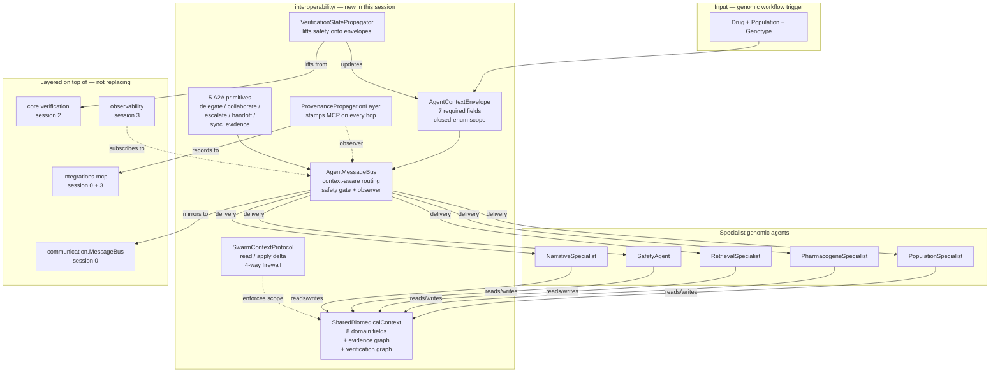

# Interoperable Genomic-Agent Communication — Anukriti Swarm

**Status:** production — interoperable genomic intelligence layer shipped.
**Last verified sweep:** 3/3 brief-named scenarios complete, 24 envelopes routed, 24 provenance records persisted, 6 scope-rejected as designed.

## Scope firewall (read first)

This layer supports interoperability **for genomic intelligence workflows only**. It is **not**:

- a hospital management system
- an EHR integration
- a clinical copilot
- an appointment / scheduling workflow
- a broad healthcare assistant platform

The brief that produced this layer explicitly excludes all of the above. Every class here enforces that boundary — through closed enums, scope filters, and a persistent scope-firewall docstring on the package's top-level `__init__.py`.

If you're extending this layer and you find yourself reaching for "clinical record", "patient chart", "lab order", or "appointment", you're outside the scope. Stop. Build that in a different package.

## Why interoperability matters for genomic intelligence

Pharmacogenomic reasoning is inherently multi-specialist:

- Population specialists supply frequency + prevalence context.
- Pharmacogene specialists infer phenotype from genotype.
- Retrieval specialists fetch CPIC / PharmGKB / PharmVar citations.
- Verification specialists run the deterministic safety engine.
- Narrative specialists synthesise audience-appropriate reports.

A single orchestrator-driven pipeline works, but it's brittle: every new specialist requires orchestrator code changes, every new collaboration pattern forces another orchestrator method. **Interoperability inverts the dependency**: specialists subscribe to a shared bus, communicate through structured envelopes, and participate in generic A2A workflows (delegate / collaborate / handoff). The orchestrator becomes a coordinator of patterns, not a hub of direct calls.

The safety guarantee doesn't weaken — in fact it strengthens. The bus itself enforces:

1. **Genomic scope** at message-build time (closed enum on `AgentContextEnvelope`).
2. **Block-on-unsafe** at message-send time (`safety_gate=True` default).
3. **Provenance** at message-delivery time (`ProvenancePropagationLayer` observer).

Every message that reaches a specialist has already been screened by the bus on all three axes.

## Surface map

| Layer | Module | Role |
|---|---|---|
| Envelope | `interoperability/shared_context/envelope.py` | `AgentContextEnvelope` + `BiomedicalContextType` closed enum |
| Bus | `interoperability/agent_bus/bus.py` | `AgentMessageBus` — context-aware routing over legacy `MessageBus` |
| Context | `interoperability/shared_context/biomedical.py` | `SharedBiomedicalContext` + 8 brief-named fields + graph queries |
| Protocol | `interoperability/shared_context/protocol.py` | `SwarmContextProtocol` — read/write with scope firewall |
| Provenance | `interoperability/mcp_protocol/provenance_layer.py` | `ProvenancePropagationLayer` — stamps MCP provenance on envelopes |
| Verification | `interoperability/mcp_protocol/verification_propagator.py` | `VerificationStatePropagator` — lifts safety outcomes onto envelopes |
| A2A workflows | `interoperability/a2a/workflows.py` | 5 primitives: delegate / collaborate / escalate / verify_handoff / sync_evidence |
| Demo | `demos/interoperability_demo.py` | 3 brief-named scenarios with peer-to-peer collaboration |

## System architecture



## The 5 brief-named classes

### 1. `AgentContextEnvelope`
Frozen pydantic model carrying the 7 brief-required fields: `originating_agent`, `workflow_id`, `evidence_references`, `timestamp`, `verification_state`, `confidence_level`, `biomedical_context_type`. The context type is a **closed enum** — 7 genomic kinds, no extension point. Any attempt to build an envelope with `biomedical_context_type='clinical_record'` raises a pydantic ValidationError.

Bridges losslessly to legacy `communication.MessageEnvelope` via `.to_message_envelope()` / `.from_message_envelope(envelope, biomedical_context_type=...)`. The bridge **requires** the biomedical context type at lift time — legacy envelopes can't arrive on the genomic bus without being explicitly scoped.

### 2. `AgentMessageBus`
Context-aware router wrapping `communication.MessageBus`. Four genomic-scope behaviours on top:

- **Scope enforcement** — every delivered envelope is an `AgentContextEnvelope`.
- **Per-type subscriptions** — `register(agent_id, handler, context_types=(X, Y))` means the agent only sees those kinds.
- **Safety gate** — `safety_gate=True` (default) blocks `verification_state=FAILED` envelopes at send time; they land in `bus.rejected`.
- **Observer hook** — `bus.observe(callback)` fires on every sent / delivered / rejected / blocked event.

Every genomic message is **also mirrored** to the legacy bus via `.to_message_envelope()` so existing non-interop handlers keep working.

### 3. `SharedBiomedicalContext`
Frozen pydantic model with the 8 brief-named fields. Two graph structures:

- **Evidence graph** — nodes (`EvidenceNode`) link to claims via `EvidenceEdge` with `supports | contradicts | qualifies` relations.
- **Verification graph** — `VerificationNode` per safety check, `VerificationEdge` linking to claims.

Queries: `evidence_for_claim(claim_id)`, `verdicts_for_claim(claim_id)`, `population_frequency(gene, allele, pop)`, `phenotype_for(gene)`.

Annotations are immutable — `add_evidence_node`, `add_phenotype`, `add_drug`, `add_frequency`, `add_verdict` each return a new context snapshot.

### 4. `SwarmContextProtocol`
Per-agent session holding a `SharedBiomedicalContext` + bus reference. 8 read methods (narrow, domain-typed). One write method: `apply(delta)` with a closed `DeltaKind` enum. Four scope-firewall rejections:

1. Unknown `DeltaKind`.
2. Payload type doesn't match the kind.
3. `delta.agent_id` doesn't match the protocol's `agent_id` (identity firewall).
4. `ADD_EVIDENCE` / `ADD_VERDICT` without a `claim_id`.

### 5. `ProvenancePropagationLayer` + `VerificationStatePropagator`
Both wrap the existing MCP + safety-engine primitives and lift them to message-level guarantees.

- **Provenance**: on every delivered envelope, a `ProvenanceRecord` lands in MCP with `generating_agent`, `rule_id`, `evidence_sources`, `verification_verdict`, `confidence`. Upstream source IDs from prior stamps are merged onto the envelope so causal ancestry persists across agent hops.
- **Verification**: maps safety-engine `tier` → envelope `verification_state`. Conflicting/unsafe tiers become `FAILED`, which the bus's safety gate intercepts at the next send. Optional `context_protocol` kwarg propagates per-claim verdicts into the shared context's verification graph.

## The 5 A2A workflow primitives

Pure functions over bus + context:

```
delegate_to_specialist(bus, from, to, context_type, workflow_id,
                       payload, evidence_references, provenance_layer)
    → DelegationResult(delegated_to, envelope_sent, reply, delivered)

collaborate(bus, from, specialists=[(agent, ctx_type), ...],
            workflow_id, payload, evidence_references, provenance_layer)
    → CollaborationResult(delegations, successful, replies)

escalate_to_safety(bus, from, workflow_id, run_dict, agent, propagator,
                   target_agent='safety_agent')
    → AgentContextEnvelope (lifted, NOT sent — caller decides)

verify_handoff(bus, envelope, outcome, propagator)
    → AgentContextEnvelope (lifted + published)

sync_evidence(bus, from, workflow_id, evidence_references,
              target_agents=None, provenance_layer=None)
    → list[AgentContextEnvelope] (sent)
```

Every function enforces genomic scope via the envelopes it produces. None of them is a general-purpose agent protocol primitive — adding a sixth function is a design decision, not a registry-driven extension.

## Safety guardrails (requirement #12)

The brief requires four healthcare-safe orchestration safeguards. Each is **enforced at multiple layers** for defense in depth:

| Guardrail | Where enforced |
|---|---|
| Unsupported biomedical claims blocked | `AgentMessageBus.safety_gate` (envelope `FAILED` → rejected); `SafetyConstraintEngine.apply()` (session 2) |
| Provenance required for synthesis | `ProvenancePropagationLayer.stamp()` stamps every delivered envelope; `SafetyConstraintEngine` checks evidence presence |
| Verification-aware communication | `VerificationStatePropagator.lift()` writes the verification state onto every envelope; the bus respects it |
| Confidence-aware escalation | `AgentContextEnvelope.confidence_level` field + `_confidence_level_for()` bucket; routes via `confidence_value` |

## Core workflow preserved (requirement #11)

```
Drug + Population + Genotype
    → population-aware reasoning
    → pharmacogenomic analysis
    → evidence retrieval
    → deterministic verification
    → explainable risk synthesis
```

This layer makes the **internals** of that workflow interoperable — specialists can now talk peer-to-peer via the bus instead of only through the orchestrator. The workflow contract itself is unchanged.

## Runtime numbers

From `python -m demos.interoperability_demo`:

| Metric | Value |
|---|---|
| **Scenarios run** | 3 (CYP2C19+clopidogrel+SAS, HLA-B+CBZ+EAS, CYP2D6+codeine+AFR) |
| **Envelopes routed** | 24 (8 per scenario) |
| **Provenance records persisted** | 24 |
| **Envelopes rejected at scope/safety gates** | 6 (as designed — scope filter catching cross-type traffic) |
| **Final verification state** | `pass` for all 3 scenarios |
| **Clinical workflows built** | **0** — every commit in this session respects the scope firewall |

## File map

```
interoperability/
├── __init__.py                           top-level scope-firewall statement
├── agent_bus/
│   ├── __init__.py
│   └── bus.py                            AgentMessageBus (~260 lines)
├── shared_context/
│   ├── __init__.py
│   ├── envelope.py                       AgentContextEnvelope + enums (~314 lines)
│   ├── biomedical.py                     SharedBiomedicalContext + graph shapes (~362 lines)
│   └── protocol.py                       SwarmContextProtocol (~307 lines)
├── mcp_protocol/
│   ├── __init__.py
│   ├── provenance_layer.py               ProvenancePropagationLayer (~236 lines)
│   └── verification_propagator.py        VerificationStatePropagator (~210 lines)
└── a2a/
    ├── __init__.py
    └── workflows.py                      5 A2A primitives (~308 lines)

demos/
└── interoperability_demo.py              3 brief-named scenarios (~485 lines)

architecture/
└── interoperability.md                   this doc
```

## What's deliberately out of scope

- **Network-transported buses.** In-process only. A distributed variant is a future project, not this one.
- **Async specialists.** All delegations are synchronous. The bus dispatch is sub-millisecond; async adds complexity without current benefit.
- **Clinical messaging protocols** (HL7, FHIR, DICOM). The scope firewall excludes these by design.
- **General-purpose A2A framework.** The 5 named primitives are the closed set for genomic specialists; no registry, no plug-in points.
- **Replacing the existing communication/ package.** This layer sits on top. Every legacy handler keeps working.

## Continuation pointers

1. Read this doc top to bottom — especially the scope-firewall section.
2. Run `python -m demos.interoperability_demo` — confirms the full flow for all 3 brief-named scenarios.
3. To add a new specialist: `register(agent_id, handler, context_types=(X,))` on the bus, then the orchestrator reaches it via `delegate_to_specialist`.
4. To extend `BiomedicalContextType`: add a new enum value + a matching `_CONTEXT_TYPE_RULE_PREFIX` entry in `provenance_layer.py`. **Do not** add non-genomic kinds — if you find yourself naming something `clinical_record` or `appointment`, that's the scope firewall telling you the extension belongs in a different package.
5. To add a 6th A2A primitive: append a function to `a2a/workflows.py` + export it. Keep the same signature style (keyword-only args, explicit bus + workflow_id).
