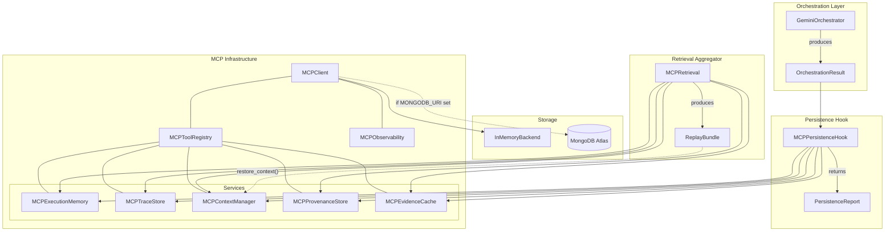
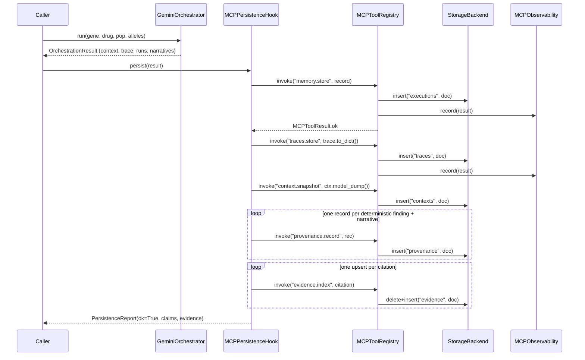
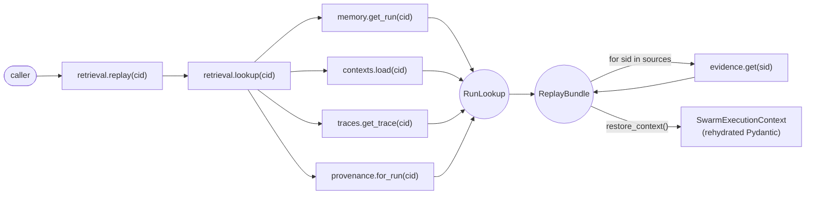
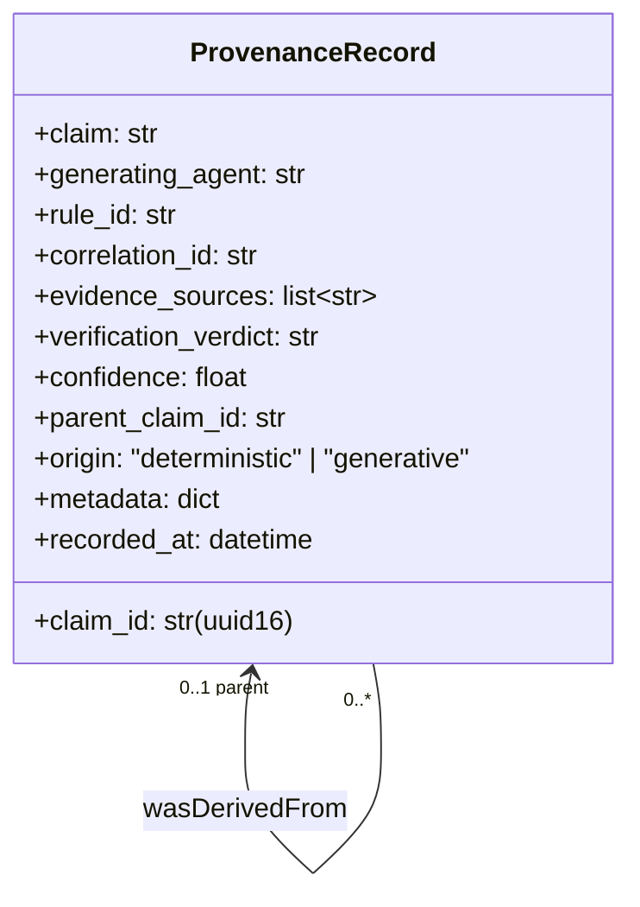
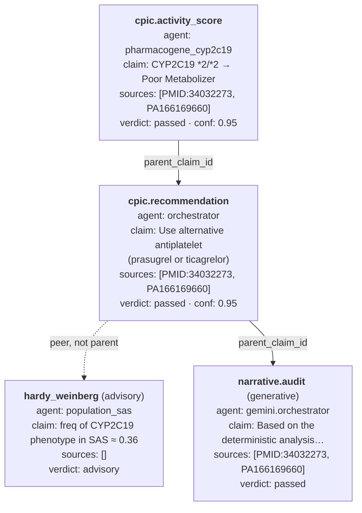
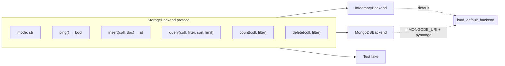
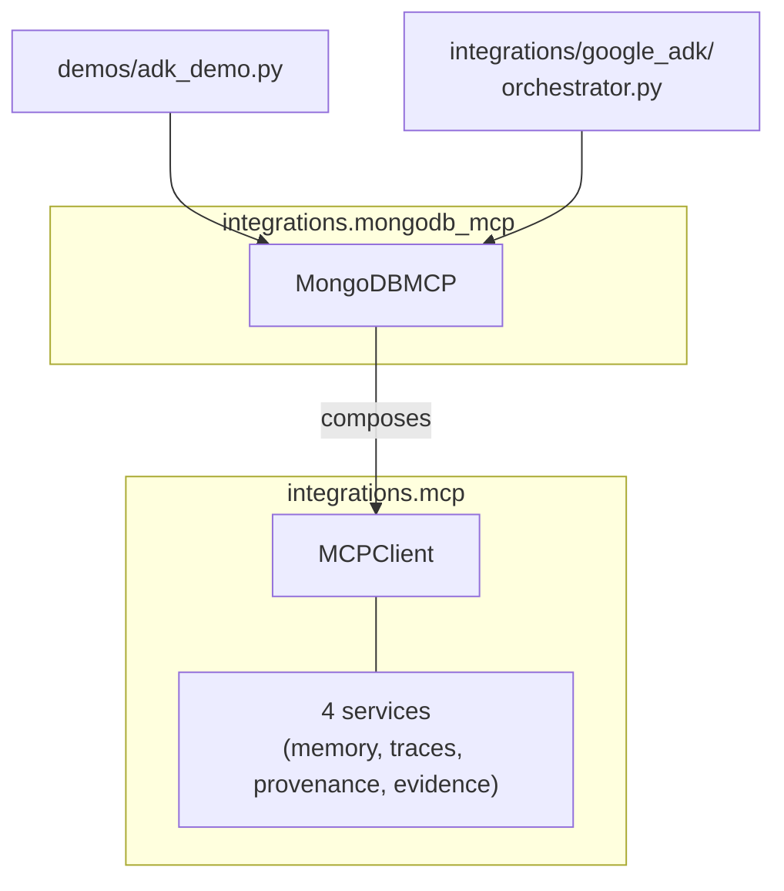

# MCP Infrastructure — Anukriti Swarm

## Purpose

Every user-facing claim produced by Anukriti Swarm must be **remembered, explainable, and replayable**. The MCP infrastructure is the persistence + observability layer that makes this guarantee operational.

It provides one piece of plumbing per concern:

| Concern | Service | Collection | What it stores |
|---|---|---|---|
| Run-level memory | `MCPExecutionMemory` | `executions` | per-run summary (gene/drug/pop, agents, refs, narratives, verdict) |
| Step-level traces | `MCPTraceStore` | `traces` | full `OrchestrationTrace` documents |
| Workflow state | `MCPContextManager` | `contexts` | `SwarmExecutionContext` snapshots for replay |
| Claim chains | `MCPProvenanceStore` | `provenance` | PROV-DM shaped `ProvenanceRecord` chains |
| Evidence cache | `MCPEvidenceCache` | `evidence` | indexed biomedical passages, dedup by `source_id` |

All five services share a single `MCPClient`, a single `MCPToolRegistry` (observability + audit), and a single pluggable `StorageBackend` (in-memory by default, MongoDB when `MONGODB_URI` is set).

## Design principles

1. **Protocol-shaped.** Every operation is a named tool call dispatched through the registry. The 26 registered tool names (`memory.store`, `traces.get`, `provenance.chain`, …) form a stable public protocol; the backend can change without touching callers.
2. **Deterministic-first, observable everywhere.** The observability wrapper folds every invocation into `MCPObservability.snapshot()` — a dashboard rendering the full tool-call history is one accessor away.
3. **No hot-path state.** Services are dataclasses with a client reference and a collection name. No in-memory caches, no singletons. Backend + observability are the only shared state.
4. **Best-effort evidence, strict core.** Memory / trace / context persistence are required for `PersistenceReport.ok`. Evidence indexing and extra provenance claims are best-effort so a malformed citation can't prevent the run from landing.
5. **Upsert on semantic keys.** Evidence dedup keys on `source_id`; provenance chain links via `parent_claim_id`; run memory keys on `correlation_id`. No synthetic surrogate keys leak through the public API.

## System map



## Write path — a single orchestration run



Key invariants enforced by the hook:

- Exactly **one `memory.store` per run**, one `traces.store` per run, one `context.snapshot` per run.
- **N+1 provenance records** per run, where N is the number of deterministic findings (phenotype + recommendation + population advisory) and +1 is the generative narrative (skipped when verification doesn't pass).
- **M `evidence.index` calls** where M is the number of distinct citation `source_id`s observed across all runs in the result (dedup is idempotent).

## Read path — replay a prior run



`MCPRetrieval.replay(cid)` is a pure read path — no mutation, no backend writes. The returned `ReplayBundle` carries enough material for:

- human inspection (render the frozen context to the CLI dashboard)
- debugging (compare the persisted trace against a fresh re-execution)
- what-if re-execution (feed `restore_context()` into a new orchestrator run)

## Provenance model (PROV-DM shape)

Every claim is persisted as one `ProvenanceRecord`. The chain is navigable via `parent_claim_id`.



### Example chain for a single run

For the scenario `CYP2C19 *2/*2 + clopidogrel + SAS` the hook produces this chain (top is earliest):



The generative narrative's `parent_claim_id` points at the recommendation, which in turn points at the phenotype — so a single `provenance.chain(narrative_id)` walks the entire reasoning tree back to a CPIC rule. This is the runtime answer to *"why did the system say this?"*

## Tool-level observability

Every dispatch through `MCPToolRegistry.invoke` flows through `MCPObservability.record`, producing a rolling snapshot accessible via `client.snapshot()`:

```json
{
  "calls": 39,
  "failures": 0,
  "success_rate": 1.0,
  "avg_latency_ms": 0.01,
  "backend_mode": "in_memory",
  "by_tool": {
    "provenance.record":  { "calls": 12, "avg_latency_ms": 0.01 },
    "evidence.index":     { "calls":  7, "avg_latency_ms": 0.02 },
    "memory.store":       { "calls":  3, "avg_latency_ms": 0.03 },
    "traces.store":       { "calls":  3, "avg_latency_ms": 0.01 },
    "context.snapshot":   { "calls":  3, "avg_latency_ms": 0.01 },
    "...": {}
  }
}
```

Separately, when `audit_tool_calls=True` (default on `MCPClient`), every `call + result` pair is persisted to the backend's `tool_calls` collection. That gives a byte-exact replay log independent of the per-service collections — useful for debugging discrepancies between "what the run produced" and "what we remembered".

## Backend abstraction



`InMemoryBackend` implements a subset of MongoDB filter operators (`$in`, `$exists`, `$gte`, `$lte`) — enough for every call site in the MCP layer. `MongoDBBackend` forwards filters verbatim to pymongo, so callers can reason about filter semantics uniformly.

The loader (`load_default_backend`) picks Mongo when both pymongo is installed **and** `MONGODB_URI` is set **and** the server pings successfully — otherwise falls back to in-memory. Services requiring guaranteed persistence should instantiate `MongoDBBackend` directly and surface connection errors themselves.

## Legacy façade

`integrations/mongodb_mcp/` predates this layer. It's kept as a thin shim over the new infrastructure so existing demos (`demos/adk_demo.py`) keep working:



Legacy rows carry a `legacy: True` tag in the shared collections so queries can distinguish them from records produced by the orchestration-tier persistence hook.

## File map

```
integrations/mcp/
├── __init__.py                public API (~20 names)
├── models.py                  MCPToolCall / Result / Observability / Origin
├── registry.py                MCPToolRegistry + audit hook
├── client.py                  MCPClient facade
├── backends/
│   ├── __init__.py            load_default_backend()
│   ├── base.py                StorageBackend protocol + InMemoryBackend
│   └── mongo.py               MongoDBBackend (pymongo)
├── memory.py                  MCPExecutionMemory       (5 tools)
├── trace_store.py             MCPTraceStore            (4 tools)
├── context_manager.py         MCPContextManager        (5 tools)
├── provenance.py              MCPProvenanceStore       (6 tools)
├── evidence.py                MCPEvidenceCache         (6 tools)
├── retrieval.py               MCPRetrieval aggregator + ReplayBundle
└── persistence_hook.py        MCPPersistenceHook for orchestration results

integrations/mongodb_mcp/
└── client.py                  Legacy façade (delegates to integrations.mcp)

demos/
├── adk_demo.py                uses legacy façade (Atlas + Gemini live)
└── mcp_infrastructure_demo.py uses new layer end-to-end (memory/replay/provenance)
```

## Performance characteristics

Measured against the in-memory backend on a single run (`CYP2C19 *2/*2 + clopidogrel + SAS`):

| Operation | Calls per run | Avg latency |
|---|---|---|
| `memory.store` | 1 | ~0.03 ms |
| `traces.store` | 1 | ~0.01 ms |
| `context.snapshot` | 1 | ~0.01 ms |
| `provenance.record` | 3–4 | ~0.01 ms |
| `evidence.index` | 2–3 | ~0.02 ms |
| **Total per run** | **8–10** | **<1 ms** |

Against MongoDB Atlas the same operations add network RTT (typically 30–100 ms per insert). The orchestration path itself stays deterministic-fast (<2 ms deterministic + ~400 ms LLM on live runs); persistence is non-blocking in the sense that it runs after `OrchestrationResult` is already constructed, so the caller sees the result before persistence completes if they want to parallelize.

## What's deliberately **not** in scope

- **Transactional writes across services.** Each service's insert is independent. A crash between `memory.store` and `traces.store` leaves an orphan memory row — `MCPRetrieval.lookup` handles this gracefully (`has_memory=True, has_trace=False`), but it's worth knowing.
- **Retention policies / TTLs.** The collections grow unbounded. For the hackathon this is fine; production deployment should add per-collection TTL indexes (48h for traces, 30d for memory, permanent for provenance + evidence would be one reasonable default).
- **Cross-run provenance joins.** `provenance.by_source` finds claims citing a given source, but there's no "show me every run that reached the same phenotype" query yet. Trivial to add on top of the existing primitives; not needed for any current call site.
- **Authentication / ACLs.** Tools are globally callable. The `MCPOrigin` tag records *who* requested each call for audit purposes but doesn't enforce access.
