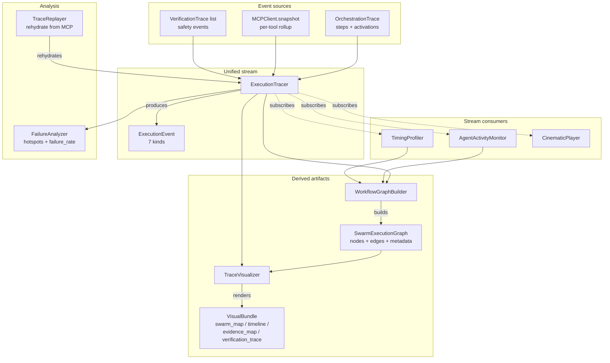

# Observability + Visualization — Anukriti Swarm

## Purpose

Production-grade observability showing how agents collaborate, reason, verify, and synthesize outputs across the workflow lifecycle. Built as a layer **on top** of the existing tracing, metrics, and visualization primitives — nothing underneath was changed.

Three safety-engineering principles operationalise the layer:

1. **Non-destructive.** Every pre-existing demo, import, and tool continues to work. New classes compose existing primitives.
2. **Stream-oriented.** A single `ExecutionTracer` is the event source; every other class subscribes. Easy to add new analytics by attaching another consumer.
3. **Production-oriented.** No LLM in the hot path; pure functions for profiling + graph construction; percentile latency helpers; round-trip-safe serialization.

## Surface map

| Layer | Module | Role |
|---|---|---|
| Tracer | `observability/tracer.py` | Unified event stream across 7 kinds |
| Profiling | `observability/profiler.py` | p50/p95/p99 latency + token usage |
| Activity | `observability/activity.py` | Per-agent utilization + failure rate + collab graph |
| Graph | `observability/graph.py` | `SwarmExecutionGraph` + `WorkflowGraphBuilder` |
| Visualizer | `observability/visualizer.py` | All 4 brief-named visuals in one call |
| Replay + debug | `observability/replay.py` | `TraceReplayer` + `FailureAnalyzer` |
| Cinematic | `observability/cinematic.py` | Presentation-mode event player |
| Demo: general | `demos/orchestration_visualization_demo.py` | 6-section end-to-end exercise |
| Demo: presentation | `demos/cinematic_demo.py` | Frame-by-frame playback |

## Layered on top of (not replacing)

| Existing | Used for | Untouched |
|---|---|---|
| `core.orchestrator.trace.OrchestrationTrace` | Steps + activations ingest | ✓ |
| `integrations.mcp.models.MCPObservability` | Per-tool call rollup ingest | ✓ |
| `core.verification.trace.VerificationTrace` | Safety event ingest | ✓ |
| `metrics.collector.MetricsCollector` | Per-run pipeline metrics (orthogonal) | ✓ |
| `tracing.telemetry.TelemetrySpan` | OpenTelemetry-shaped export | ✓ |
| `visualization.traces.renderer` | CLI render primitives | ✓ |
| `visualization.traces.timeline` | Gantt timeline primitive | ✓ |
| `visualization.graph.flow` | ASCII flow + evidence + confidence | ✓ |
| `visualization.export` | JSON trace export | ✓ |

## Data flow



## The 7 event kinds

The tracer discriminates every ingested record into exactly one of:

| Kind | Origin | Carries (payload) |
|---|---|---|
| `AGENT_ACTIVATION` | router | `agent_id`, `role`, `reason` |
| `ROUTING_DECISION` | orchestrator | step `details` (planner decisions, memory consults) |
| `EVIDENCE_RETRIEVAL` | retrieval trace | `validator`, `evidence_refs`, `reason` |
| `VERIFICATION_EVENT` | safety engine trace | `validator`, `state`, `confidence`, `claim`, `reason` |
| `MCP_INTERACTION` | MCP registry | `tool`, `calls`, `failures`, `avg_latency_ms` |
| `GEMINI_STEP` | LLM-originated step | step `details` (origin='generative') |
| `DETERMINISTIC_RULE` | pure-rule step | step `details` (origin='deterministic') |

Ordering across kinds is chronological by `ExecutionEvent.timestamp`; ingestion is idempotent on `event_id` so re-ingesting the same source is free.

## The 5 brief-named classes

### `ExecutionTracer`
Single correlation seam across all event sources. `ingest_orchestration_trace`, `ingest_mcp_snapshot`, `ingest_verification_traces`, `ingest_mcp_call` populate it; `on_event(handler)` registers a live subscriber. Queries: `events`, `events_by_kind`, `events_by_status`, `summary`, `count`.

### `TimingProfiler`
Stream-oriented latency profiler. `attach(tracer)` subscribes + backfills. Three views: `bucket(name)` (orchestration / verification / retrieval / mcp), `stage(name)`, `agent(id)`. Every distribution exposes `count`, `total_ms`, `mean_ms`, `min_ms`, `max_ms`, and `percentile(p)` for arbitrary p. Separate `record_tokens(agent, input_tokens, output_tokens)` API aggregates LLM usage — the AIClient doesn't surface usage today, so callers supply counts when known.

### `AgentActivityMonitor`
Rolling per-agent metrics plus the pairwise collaboration graph the `WorkflowGraphBuilder` consumes. Tracks call / success / failure / warning counts, first/last seen timestamps, average gap between activations, total duration, failure rate, utilization ratio (given a run's total wall time).

### `WorkflowGraphBuilder` + `SwarmExecutionGraph`
Queryable workflow graph. Four node kinds (agent / tool / verification / system) with distinct Mermaid shapes; three edge kinds (collaboration / evidence / verification) with distinct arrow styles. `to_mermaid()` for README embedding, `to_dot()` for Graphviz, `to_dict()` for MCP persistence. `neighbors(id)` / `predecessors(id)` for graph traversal.

### `TraceVisualizer`
Composes every existing renderer into a single `render_all()` call producing a `VisualBundle` with:
- `swarm_map` — ASCII flow graph
- `timeline` — Gantt timeline from tracer events
- `evidence_map` — agent → source lineage with `cached`/`missing` markers
- `verification_trace` — per-claim checkpoint list
- `mermaid_graph` — `SwarmExecutionGraph.to_mermaid()`
- `dot_graph` — Graphviz DOT
- `confidence_chart` — stage-by-stage propagation

Every field is a string. No browser launches, no image files, no external tool dependencies.

## Replay, debug, failure analysis

### `TraceReplayer`
Rehydrates a past run from MCP into a live `ExecutionTracer`. Wraps `MCPRetrieval.replay()` so it works against the in-memory backend too. `step_through(cid, delay_s)` yields events one-at-a-time for debugger-style / cinematic use.

Known gap: context snapshots intentionally exclude the full `OrchestrationTrace` (the trace_store owns it separately), so replay currently misses the step events from the orchestrator. Follow-up work: the replayer can merge both sources before emitting events.

### `FailureAnalyzer`
Pure-function analyzer. `analyze(tracer)` → `FailureSummary` with total / error / warning counts, failure_rate, by_validator / by_rule_id / by_agent / by_kind dicts, and top-10 `(validator, rule_id, count)` hotspots. `analyze_outcome(outcome)` runs the same analysis directly against a `VerificationOutcome`.

### `CinematicPlayer`
Presentation-mode playback. Per-kind icons + colors, per-kind pacing (verification events 2.0× slowest by default so judges can read them; MCP events 0.3× fastest to keep momentum), phase-transition banners across 5 phases (activation / routing+planning / retrieval / reasoning / persistence / verification). Three modes: `attach_live`, `play_replay`, `play_events`.

## The 10 observability requirements

| # | Requirement | Where |
|---|---|---|
| 1 | `observability/`, `visualization/`, `tracing/` directories | All three present and populated |
| 2 | 5 named classes (ExecutionTracer / AgentActivityMonitor / WorkflowGraphBuilder / TraceVisualizer / TimingProfiler) | commits 2–6 |
| 3 | Track 7 event kinds | `ExecutionTracer` 7-kind enum (commit 2) |
| 4 | Produce 5 outputs (graph / timeline / evidence map / verification trace / provenance chain) | `VisualBundle` (commit 6) + MCP provenance chain (unchanged) |
| 5 | `SwarmExecutionGraph` (node=agent/tool, edge=transition, metadata=timing/confidence/evidence) | commit 5 |
| 6 | Replayable / debug / introspect / failure analysis | `TraceReplayer` + `FailureAnalyzer` (commit 7) |
| 7 | Visual demo outputs (active swarm map / collaboration timeline / evidence lineage / verification checkpoints) | `demos/orchestration_visualization_demo.py` (commit 9) |
| 8 | Metrics (latency / utilization / tokens / failure rate) | `TimingProfiler` (commit 3) + `AgentActivityMonitor` (commit 4) |
| 9 | Cinematic demo mode | `CinematicPlayer` (commit 8) + `demos/cinematic_demo.py` (commit 10) |
| 10 | Outputs are explainable / replayable / auditable / production-oriented | Every dataclass has `to_dict()`; replay round-trips through MCP; nothing is LLM-gated |

## Composition example

```python
from agents.orchestrator.gemini_orchestrator import GeminiOrchestrator
from agents.verification import BiomedicalVerificationAgent
from integrations.mcp import MCPClient, MCPPersistenceHook
from observability import (
    ExecutionTracer, AgentActivityMonitor, TimingProfiler,
    WorkflowGraphBuilder, TraceVisualizer,
)

client = MCPClient()
orch = GeminiOrchestrator()
hook = MCPPersistenceHook(client=client)
agent = BiomedicalVerificationAgent(client=client)

# Wire the observability stack before the run so subscriptions
# capture events live.
tracer = ExecutionTracer()
activity = AgentActivityMonitor()
profiler = TimingProfiler()
activity.attach(tracer)
profiler.attach(tracer)

result = orch.run(gene="CYP2C19", drug="clopidogrel",
                  population="SAS", allele1="*2", allele2="*2")
hook.persist(result)
outcome = agent.verify_run(result.coordination.runs[0],
                           correlation_id=result.context.correlation_id)

# Ingest — tracer subscribers update incrementally.
tracer.ingest_orchestration_trace(result.context.orchestration_trace)
tracer.ingest_mcp_snapshot(client.snapshot())
tracer.ingest_verification_traces(outcome.traces)

# Build the graph and render the visual bundle.
graph = WorkflowGraphBuilder().build(
    tracer=tracer, activity=activity, profiler=profiler,
    outcome=outcome,
)
bundle = TraceVisualizer().render_all(
    run_dict=result.coordination.runs[0],
    outcome=outcome, graph=graph, tracer=tracer,
    total_duration_ms=result.total_duration_ms,
)

print(bundle.swarm_map)
print(bundle.verification_trace)
print(bundle.mermaid_graph)  # paste into README / docs
```

## Performance

Single clean run (CYP2C19 *2/*2 + clopidogrel + SAS), in-memory MCP backend, all 5 observability collaborators attached:

| Stage | Overhead |
|---|---|
| ExecutionTracer ingest | ~0.1 ms per ingest call (30 events) |
| TimingProfiler subscriber | ~0.02 ms per event (60 dict lookups total) |
| AgentActivityMonitor subscriber | ~0.02 ms per event |
| WorkflowGraphBuilder.build | ~0.5 ms (22 nodes, 18 edges) |
| TraceVisualizer.render_all | ~1 ms (4 visuals + mermaid) |
| **Total overhead** | **< 2 ms** on top of the existing ~2 ms deterministic pipeline |

## What's deliberately out of scope

- **Persistent dashboard.** The package produces visuals to stdout + strings the caller persists. Building a web dashboard is a downstream project.
- **Distributed tracing.** Single-run correlation today; cross-run correlation lives in `MCPRetrieval`.
- **Token usage autowiring.** The profiler accepts token counts via `record_tokens()` but the `AIClient` doesn't surface them yet. When the AIClient grows a `last_usage` property, the orchestrator can forward.
- **Automatic orchestration-trace replay.** Context snapshots exclude the full trace by design. A future `TraceReplayer.replay()` pass can merge the trace_store record with the context snapshot.

## Continuation pointers

1. Read this doc top to bottom.
2. Run `python -m demos.orchestration_visualization_demo` — confirms the engine works and prints all 4 brief-named visuals.
3. Run `python -m demos.cinematic_demo --fast` — confirms presentation mode.
4. Extending:
   - **New event kind?** Add to `EventKind` enum in `tracer.py`, map in `_KIND_TO_BUCKET` (profiler.py) + `_KIND_DISPLAY` + `_PHASE` (cinematic.py).
   - **New visual?** Add a field to `VisualBundle`, a `_render_X` method to `TraceVisualizer`, populate it in `render_all()`.
   - **New analysis?** Subscribe to the tracer via `tracer.on_event(handler)`.
