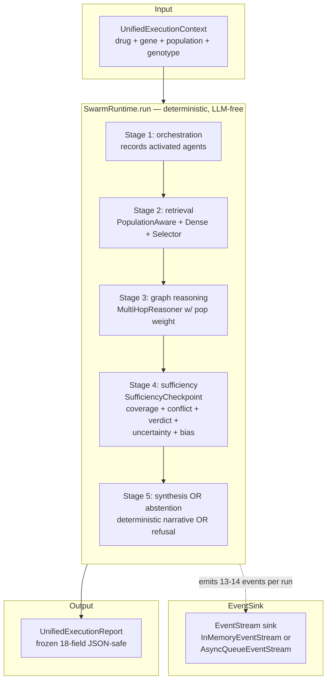

# Unified Swarm Runtime — Anukriti Swarm

**Status:** production — unified runtime + live backend + D3 visualization shipped (session #7).
**Positioning:** *AI mission control for genomic intelligence.*

## Scope firewall (read first)

The `SwarmRuntime` is **not**:

- a new orchestrator — it is a thin sequencer that composes existing modules
- a multi-query planner — one context per run; concurrent runs are handled by FastAPI workers
- a persistence layer — the runtime is ephemeral; MCP persists what needs persisting
- an authentication/authorization service — out of scope for a research demo
- a SaaS dashboard platform — the frontend is live orchestration, not a CRUD UI

What it IS: a lifecycle class that composes the repository's existing modules (orchestrator / retrieval / KG / sufficiency / verification / interop / MCP / observability / narrative) into one callable with one `UnifiedExecutionReport` output, streaming events at every stage boundary so the FastAPI + WebSocket layer can forward them to a live D3-visualized frontend.

## Positioning

> *AI mission control for genomic intelligence.*
>
> Unified orchestration · deterministic core · live-stream observable · population-aware · provenance-preserving.

Not a chatbot, not a SaaS dashboard, not an EHR. A deterministic runtime with an opt-in live UI that visualizes every decision the swarm makes on a pharmacogenomic query.

## Why a unified runtime?

Before session #7, the repository had five+ demos, each exercising a different slice of the swarm:

- `showcase.py` — the 7-stage pipeline (population → pharmacogene → retrieval → verification → narrative)
- `safety_demo.py` — deterministic safety engine + 4 adversarial scenarios
- `interoperability_demo.py` — agent message bus + A2A workflows
- `evaluation_demo.py` — 6-suite evaluation + stress tests
- `evidence_sufficiency_demo.py` — governance + verdict + uncertainty + bias
- `evidence_sufficiency_abstention_demo.py` — 5 adversarial refusal paths

Every demo shared the same deterministic core (rules, guidelines, MCP, KG) but presented its slice independently. Users asking "how does this all work together?" had to read 5+ demos.

The unified runtime answers the question in one object: `SwarmRuntime.run(UnifiedExecutionContext) → UnifiedExecutionReport`. One lifecycle, one report, one event stream, one UI.

## Architecture



Every stage reads the context, mutates specific state slots on it, and emits one or more `RuntimeEvent`s through the injectable sink. The final `UnifiedExecutionReport` is a frozen snapshot taken from the context once all stages complete.

## The 5 stages

### Stage 1 — orchestration

Records the `orchestrator` agent as activated. Populates `context.orchestration_trace` with a 2-step sequence (intake → dispatch). Emits `AGENT_ACTIVATED` (one per new agent).

The existing Gemini orchestrator code path is available but not used by the runtime's default stage — the deterministic stage function is sufficient for the evidence-sufficiency story. Swapping in the Gemini orchestrator is a stage-function replacement; the runtime's event contract is unchanged.

### Stage 2 — retrieval

Multi-strategy: builds a `BiomedicalQuery`, runs `PopulationAwareRetriever` + `DenseSemanticRetriever` (both from phase 2 of the sufficiency brief), merges via `EvidenceSelector` (dedup + diversity cap). Records `population_aware_retriever` as activated. Populates `context.evidence_state` with citations + strategy. Emits `RETRIEVAL_COMPLETE`.

### Stage 3 — graph reasoning

`MultiHopReasoner.find_paths` from the allele/phenotype node to the drug node with the target `SuperPopulation` supplied for path weighting. Records `graph_reasoner` as activated. Populates `context.graph_state` with start/goal ids + serialized paths. Emits `GRAPH_TRAVERSAL`.

### Stage 4 — sufficiency

The SufficiencyCheckpoint (session #6 phase 6) runs all four layers:
- `ContextSufficiencyAgent` (coverage + conflict + sufficiency decision)
- `SetLevelEvidenceVerifier` (5-verdict rollup)
- `UncertaintyScoringEngine` (4-tier uncertainty)
- `PopulationEvidenceBiasDetector` (3 bias kinds)

Records `sufficiency_checkpoint` + optionally `population_bias_detector` as activated. Populates `context.evidence_state.checkpoint`, `context.verification_state`, `context.uncertainty_state`, `context.provenance_state`. Emits `SUFFICIENCY_DECISION` + `VERIFICATION_CHECKPOINT` + `UNCERTAINTY_TRANSITION` + `PROVENANCE_PERSISTED` in order.

### Stage 5 — synthesis OR abstention

If `allows_synthesis` from the checkpoint is `True`: records `narrative_agent` as activated, generates deterministic rule-based narrative text (no LLM), populates `context.narrative_output`, emits `SYNTHESIS_EMITTED`.

If `allows_synthesis` is `False`: emits `SAFE_ABSTENTION` with the blocking reason. No narrative agent is activated; the report's `final_recommendation` will be a refusal record.

## RuntimeEvent — 12 closed kinds

```
RUN_STARTED              lifecycle begins; carries scope
AGENT_ACTIVATED          specialist agent fires
RETRIEVAL_COMPLETE       retrieval stage produced an evidence set
GRAPH_TRAVERSAL          KG reasoning produced paths
SUFFICIENCY_DECISION     sufficiency engine emitted a decision
VERIFICATION_CHECKPOINT  set-level verifier emitted a verdict
UNCERTAINTY_TRANSITION   uncertainty tier + action recorded
PROVENANCE_PERSISTED     provenance chain persisted
SYNTHESIS_EMITTED        narrative synthesis produced
SAFE_ABSTENTION          runtime refused to synthesize; terminal
RUN_COMPLETED            lifecycle ended (success)
RUN_FAILED               lifecycle ended (fatal error)
```

Extending is a code change; the closed enum is enforced at the type boundary.

Event shape (frozen dataclass):
```python
RuntimeEvent(
    event_id:       "a1b2c3d4e5f6...",  # 16-char hex uuid slice
    kind:           RuntimeEventKind.AGENT_ACTIVATED,
    correlation_id: "unified_abc123def456",
    timestamp:      datetime (UTC),
    payload:        {"agent": "graph_reasoner"},  # primitive-only dict
)
```

Every event is JSON-safe via `.to_dict()`.

## Event count per run

- **Sufficient path** (SAS + clopidogrel): 14 events
  `RUN_STARTED` + 5 `AGENT_ACTIVATED` + `RETRIEVAL_COMPLETE` + `GRAPH_TRAVERSAL` + `SUFFICIENCY_DECISION` + `VERIFICATION_CHECKPOINT` + `UNCERTAINTY_TRANSITION` + `PROVENANCE_PERSISTED` + `SYNTHESIS_EMITTED` + `RUN_COMPLETED`

- **Abstention path** (AFR + codeine): 13 events
  Same as sufficient, but no `AGENT_ACTIVATED(narrative_agent)` and no `SYNTHESIS_EMITTED`; `SAFE_ABSTENTION` replaces them.

## UnifiedExecutionContext

Mutable per-run state container. Unlike the repository's other frozen audit records, this class IS mutable — it accumulates state as stages complete. The final `UnifiedExecutionReport` is a frozen snapshot taken at the end.

**Rationale for mutable-plus-snapshot**: the runtime has 10+ stages; chaining frozen records through every stage would force every stage to rebuild the whole envelope, and the event stream needs to emit mid-stage without copy-on-write.

**Scope firewall at the factory boundary** (`UnifiedExecutionContext.new`):
- `drug` — non-empty str, normalised to lowercase
- `gene` — non-empty str, normalised to uppercase
- `population` — `SuperPopulation` enum instance OR canonical 3-letter code; `'SouthAsian'` is rejected at the type boundary
- `genotype` — defaults to `'unknown'`
- `question` — optional free-form string

**State slots** (populated by stages, read by consumers):
- `orchestration_trace` — stage 1
- `evidence_state` — stage 2 + updated by stage 4 with `.checkpoint`
- `graph_state` — stage 3
- `verification_state` — stage 4
- `uncertainty_state` — stage 4
- `provenance_state` — stage 4
- `narrative_output` — stage 5
- `activated_agents` — updated across stages
- `errors` — non-fatal errors recorded here; fatal errors trigger `RUN_FAILED`

## UnifiedExecutionReport

Frozen final record with 18 top-level fields. Every brief requirement #5 bullet maps to a first-class field:

```
orchestration_trace       stage 1 output
activated_agents          tuple in insertion order
evidence_sufficiency      CheckpointResult.to_dict
uncertainty_analysis      flattened (score, action, bias_findings)
graph_traversal           list of GraphPath.to_dict
deterministic_rules       dedup tuple of rule ids across the run
provenance_chain          list of ProvenanceRecord dicts
final_recommendation      synthesis text OR refusal record
```

Plus identity (report_id + correlation_id + generated_at), scope keys (drug / gene / population / genotype / question), total_duration_ms, and errors.

`from_context(ctx, total_duration_ms=...)` is the canonical factory. Every extraction is defensive — missing or partial stages yield empty collections rather than raising, so a run that aborts mid-sufficiency still produces a valid report.

## Scope firewall summary

| Boundary | Mechanism |
|---|---|
| Runtime inputs | `UnifiedExecutionContext.new` validates drug/gene non-empty + coerces population to `SuperPopulation` (closed enum) |
| Event kinds | `RuntimeEventKind` closed 12-value enum |
| Stage order | Fixed in `SwarmRuntime.run`; stage functions are `_stage_*` private methods |
| Error isolation | Fatal stage errors caught at the runtime boundary; a `RUN_FAILED` event + partial report is returned, never a raise into the FastAPI handler |
| Event stream | `EventStream` ABC; sinks implement `emit(event) -> None`; broken sinks cannot break the runtime (InMemoryEventStream swallows subscriber exceptions) |
| Determinism | Same input produces byte-identical reports modulo fresh uuids/timestamps |

## Determinism properties

- `SwarmRuntime.run(ctx)` produces the same decision / verdict / uncertainty / activated_agents / deterministic_rules / graph_traversal count for the same input
- Two SwarmRuntime instances on the same input produce matching reports
- The event stream preserves deterministic order: `RUN_STARTED` first, `RUN_COMPLETED` / `RUN_FAILED` last, stage events in fixed order in between

Verified by session-#7 phase-2 smoke tests (6 checks: sufficient path, abstention path, HLA-B path, runtime reuse, JSON-safety, determinism).

## Composition — what the runtime uses vs owns

| Component | Source | Runtime role |
|---|---|---|
| `SuperPopulation` | `core/models/population.py` | boundary enum on context |
| `BiomedicalQuery` + retrievers + selector | `retrieval/multi_strategy/` | stage 2 composition |
| `GraphContextBuilder` + `PopulationGraphIndexer` + `MultiHopReasoner` | `knowledge_graph/` | stage 3 composition |
| `SufficiencyCheckpoint` | `core/evidence_sufficiency/checkpoint.py` | stage 4 composition (the 4-layer checkpoint) |
| `ProvenanceRecord` | `integrations/mcp/provenance.py` | stage 4 provenance_records |
| `RetrievedEvidence` + `BiomedicalDocument` | `retrieval/evidence/` | retrieval inputs |

The runtime owns **only** the lifecycle sequencing and event emission. Every domain module is used unchanged.

## Integration with the existing orchestrator coordinator

The unified runtime does NOT replace `core.orchestrator.coordinator.ExecutionCoordinator`. The coordinator is the original orchestration seam used by `showcase.py` / `safety_demo.py` / `evaluation_demo.py` and it retains its off-by-default sufficiency hook from session #6.

The two coexist:
- **Coordinator** — used by flagship demos; byte-identical session-#5 signatures preserved
- **SwarmRuntime** — used by the unified demo + FastAPI backend; designed for live observability and comparative views

A future consolidation could route the coordinator's stages through SwarmRuntime's event emission, but that's a deliberate follow-up that requires re-establishing flagship signatures.

## Performance

Measured on a single Python 3.12 interpreter, no LLM, localhost:

- Single-scenario lifecycle (Clopidogrel + CYP2C19 + SAS): **~5 ms** end-to-end
- Three-scenario flagship trio (sync): **~15 ms** total
- WebSocket per-event latency: dominated by browser paint, not runtime

Component-sharing across runs: `SwarmRuntime._ensure_components()` lazy-builds the KG + indexer + reasoner + retrievers + checkpoint on first `run()` call; subsequent runs reuse the same objects. First run includes KG assembly (~30 ms); subsequent runs pay only lifecycle cost.

## File map

```
core/runtime/
  __init__.py           scope firewall + exports
  context.py            UnifiedExecutionContext (mutable per-run)
  events.py             RuntimeEvent + RuntimeEventKind (12) +
                        EventStream ABC + InMemoryEventStream
  report.py             UnifiedExecutionReport (frozen; from_context
                        extractor + 18-field to_dict)
  runtime.py            SwarmRuntime (5-stage lifecycle class)

demos/
  unified_demo.py       3-scenario runner; delegates to SwarmRuntime

backend/                FastAPI + WebSocket layer (phase 3)
  see architecture/backend-api.md
```

## Continuation pointers

- **Consolidate coordinator + runtime** — route coordinator stages through SwarmRuntime's event emission so flagship demos also produce live events
- **Real LLM in stage 5** — plug the Gemini orchestrator into the synthesis stage; the runtime contract stays unchanged
- **MCP replay** — cross-worker replay requires backing the frontend cache with MCP; the WS-originated run cache is currently per-worker in-memory only
- **Multi-population comparative runs** — the flagship trio runs three scenarios sequentially; a `CompareRuntime` that runs them in parallel and aggregates a cross-population report is natural next work

## Out of scope (do not build here)

- Authentication / user accounts
- Multi-tenant session storage
- Arbitrary query planning (the runtime takes a fully-typed context; planning is upstream)
- Mutation-at-rest of reports (reports are frozen snapshots)
- Streaming WebSocket multiplexing (one connection = one run)

Each of these has been deliberately declined to keep the runtime narrow, auditable, and reusable.
