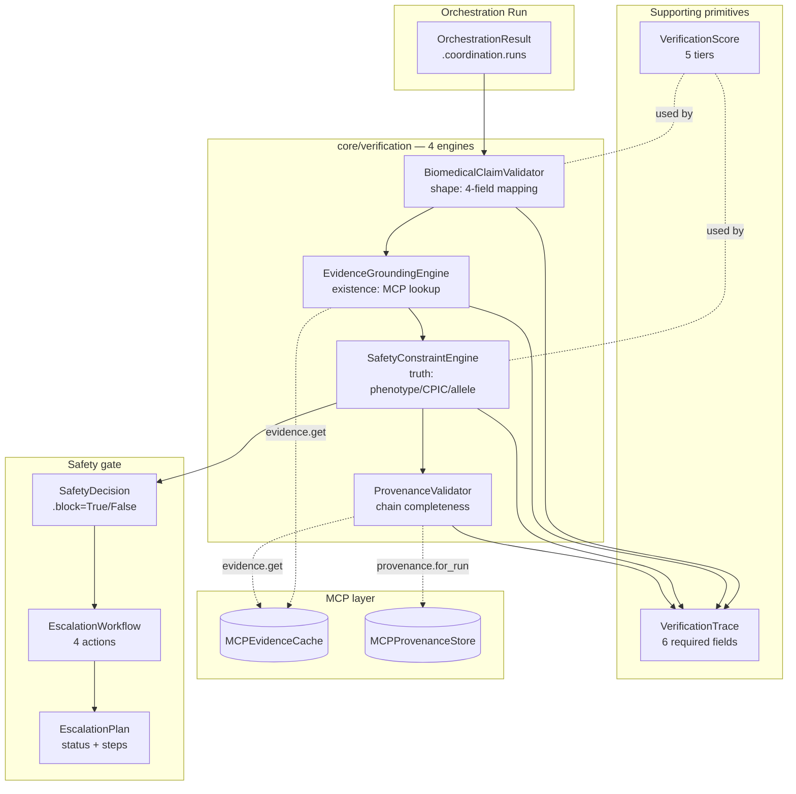
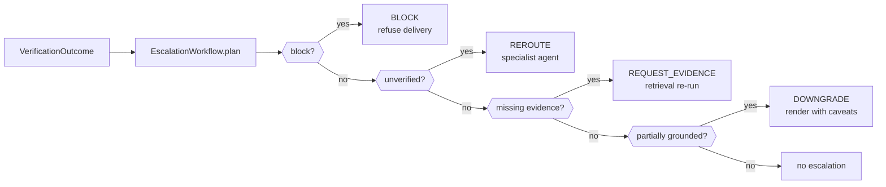

# Deterministic Verification & Biomedical Safety Engine — Anukriti Swarm

## Purpose

No biomedical output reaches a user without **deterministic validation and evidence grounding**. This document describes the safety engine that enforces that guarantee.

The engine operationalises three safety-engineering principles:

1. **Deterministic-first.** Every validation rule is a pure function of inputs. No LLM calls, no non-reproducibility. Same inputs → same verdict, always.
2. **Block-on-unsafe.** A single `UNSAFE` or `CONFLICTING` signal anywhere in the pipeline refuses delivery outright. No amount of grounded claims can override it.
3. **Fully auditable.** Every claim produces a `VerificationTrace` with the 6 fields the brief names (claim, validator, evidence refs, state, confidence, escalation events). Traces round-trip through MCP so any delivered (or blocked) output can be replayed.

## Surface map

| Layer | Module | Role |
|---|---|---|
| Scoring | `core/verification/scoring.py` | 5-tier `VerificationTier` + `classify_score()` |
| Trace | `core/verification/trace.py` | `VerificationTrace` frozen dataclass + `EscalationEvent` |
| Claim validator | `core/verification/claim_validator.py` | Shape check — every claim maps to evidence + rule + source + outcome |
| Grounding engine | `core/verification/grounding.py` | Existence check — every cited source resolves in MCP evidence cache |
| Safety engine | `core/verification/safety.py` | Truth check — phenotype / CPIC / allele / recommendation correctness |
| Provenance validator | `core/verification/provenance_validator.py` | Chain completeness — audits persisted MCP provenance records |
| Agent | `agents/verification/agent.py` | `BiomedicalVerificationAgent` composes the 4 engines |
| Workflow | `core/verification/escalation_workflow.py` | 4 active actions (reroute / request_evidence / downgrade / block) |
| Benchmarks | `benchmarks/adversarial.py` | 4 scenarios exercising the failure paths |
| Demo | `demos/safety_demo.py` | End-to-end demonstration |

## System map



## The 5 scoring tiers

| Tier | When it fires | Delivery behaviour |
|---|---|---|
| `grounded` | All checks pass + confidence is `HIGH` | Deliver clean |
| `partially_grounded` | WARNs present or confidence < HIGH | Deliver with caveats (`DOWNGRADE`) |
| `unverified` | At least one non-critical FAIL | Escalate (`REROUTE` / `REQUEST_EVIDENCE`) |
| `conflicting` | `guideline_conflict` check FAILs | **Block** — two sources disagree |
| `unsafe` | `hallucination_detection` or phenotype drift FAIL | **Block** — known-bad signal |

Ordering is **monotonic in safety**: `UNSAFE > CONFLICTING > UNVERIFIED > PARTIALLY_GROUNDED > GROUNDED`. `worse_of(a, b)` always returns the less-safe tier — a single `UNSAFE` claim anywhere in a run pulls the whole aggregate down to `UNSAFE`.

## The 4 engines — what each is responsible for

### 1. `BiomedicalClaimValidator` (shape)

Enforces that every biomedical statement maps to the 4 fields the brief names:
1. **evidence** — at least one source id (PMID / CPIC / PharmGKB / PharmVar)
2. **deterministic rule** — a `rule_id` (e.g. `cpic.activity_score`, `hardy_weinberg`)
3. **source reference** — a `guideline_source` or provenance origin
4. **verification outcome** — pass/fail/warn

Pure of external state. No MCP calls. Catches "you forgot to cite" in O(1) per claim even when MCP is offline.

### 2. `EvidenceGroundingEngine` (existence)

Checks that the evidence ids a claim *names* actually *resolve* to real biomedical passages in the MCP evidence cache. Three outcomes:

| Grounding | State | Reason |
|---|---|---|
| All refs resolve | pass (preserved) | Full grounding |
| Some refs resolve | warn (downgrade) | Partial grounding — deliver with caveats |
| Zero refs resolve | **fail** | Hard downgrade — evidence layer has no idea what we're talking about |

Produces a `GroundingReport` with coverage ratio + missing source list — the `EscalationWorkflow` uses these to decide when to fire `REQUEST_EVIDENCE`.

### 3. `SafetyConstraintEngine` (truth)

The **truth** layer. Re-derives key facts from the project's authoritative deterministic modules and compares to what the run produced:

| Check | Authoritative source | FAIL means |
|---|---|---|
| `allele_interpretation` | `rules.phenotype_rules.ALLELE_ACTIVITY_SCORES` | Unknown allele in the diplotype |
| `phenotype_correctness` | `rules.phenotype_rules.infer_phenotype` | Stated phenotype disagrees with the rule — **UNSAFE** |
| `cpic_alignment` | `guidelines.cpic.lookup_recommendation` | Recommendation doesn't match CPIC (or no entry exists) |
| `recommendation_consistency` | `verification.rules.checks.check_guideline_conflict` | Two contradictory recs for the same drug |

Returns a `SafetyDecision(tier, block, reason, traces, score)`. **`.block`** is the single authoritative "do not surface" signal — nothing else in the engine overrides it.

### 4. `ProvenanceValidator` (chain completeness)

Audits the provenance records the `MCPPersistenceHook` left behind. Catches the case where everything in-memory passed but the persisted trail is incomplete:

| Check | FAIL means |
|---|---|
| `rule_id_coverage` | Persisted record has empty `rule_id` |
| `agent_attribution` | Persisted record has empty `generating_agent` |
| `chain_completeness` | Record's `parent_claim_id` points at a non-existent parent |
| `evidence_resolvability` | Record cites a source id that isn't indexed in MCP |

Empty chain (no records for a correlation_id) is itself a FAIL — an orchestration that ran but didn't persist is an audit failure.

## The 4 escalation actions



Priority is strict (top-down): `BLOCK` fires first, then `REROUTE`, then `REQUEST_EVIDENCE`, then `DOWNGRADE`. Per-claim escalation events emitted by the engines bubble up de-duped against these aggregate steps so nothing is lost.

### Plan status

- **`none`** — no escalations, clean delivery
- **`mitigated`** — warn-level escalations only (downgrade, request_evidence), deliver with caveats
- **`blocked`** — at least one BLOCK step fired, refuse delivery

## Adversarial coverage

The 4 scenarios in `benchmarks/adversarial.py` exercise one specific failure path each:

| Scenario | Failure path | Expected tier | Expected action |
|---|---|---|---|
| `conflicting_evidence_clopidogrel` | Two opposing recs for clopidogrel | CONFLICTING | BLOCK |
| `ambiguous_genotype_phenotype_drift` | *1/*1 stated as PM (rule says NM) | UNSAFE | BLOCK |
| `missing_evidence_fabricated_pmids` | Fake PMID citations | UNVERIFIED | REQUEST_EVIDENCE |
| `ancestry_edge_unknown_allele` | *99 (unknown allele) | UNVERIFIED | REROUTE |

4/4 match observed behaviour. The demo prints a governance audit summary showing the engine enforced every expected constraint.

## Composition

The public surface is `BiomedicalVerificationAgent` in `agents/verification/agent.py`. Callers pass a run dict + correlation_id:

```python
from agents.verification import BiomedicalVerificationAgent
from core.verification.escalation_workflow import EscalationWorkflow
from integrations.mcp import MCPClient

client = MCPClient()
agent = BiomedicalVerificationAgent(client=client)
workflow = EscalationWorkflow()

outcome = agent.verify_run(run_dict, correlation_id=cid)
plan = workflow.plan(outcome)

if plan.is_blocked:
    # Refuse delivery. Surface plan.steps to the user or admin
    # for explanation.
    ...
elif plan.status == "mitigated":
    # Deliver with caveats from DOWNGRADE / REQUEST_EVIDENCE steps.
    ...
else:
    # Clean delivery.
    ...

# Full audit report
print(agent.audit_report(outcome))
```

`VerificationOutcome.to_dict()` is JSON-safe and can be persisted directly through MCP — every field matches the `MCPProvenanceStore` record shape.

## Backward compatibility

The safety engine is **additive**. Nothing in the existing codebase changes its behaviour:

- `workflows.pharmacogenomic_pipeline` continues to use the legacy `VerificationAgent` in `agents/verification/legacy_agent.py` via the preserved `from agents.verification import VerificationAgent` import path.
- `core.orchestrator.coordinator._propagate_verification` is unchanged — the new engines run *alongside* the existing one, not in place of it.
- All 20 existing demos pass unchanged; `demos/safety_demo.py` is the 21st.

## What's deliberately out of scope

- **Cross-run provenance joins.** "Show me every run that reached the same phenotype" is a useful query but needs no dedicated code — it's trivially expressible via `MCPRetrieval`.
- **Per-check statistical priors.** We don't maintain confidence distributions per check across runs. Each invocation is independent.
- **LLM-based validation.** Out by design. Every rule is a pure function.
- **Retry loops.** Escalation workflows emit `REQUEST_EVIDENCE` steps but do not actually re-run retrieval — that's the orchestrator's responsibility to interpret and re-plan. The workflow names the action; execution belongs to the orchestrator.

## Performance

Single clean run end-to-end (CYP2C19 *2/*2 + clopidogrel + SAS), in-memory MCP backend:

| Stage | Latency |
|---|---|
| BiomedicalClaimValidator | ~0.05 ms (pure) |
| EvidenceGroundingEngine | ~0.2 ms (5–10 MCP lookups) |
| SafetyConstraintEngine | ~0.2 ms (re-runs rule + CPIC lookup) |
| ProvenanceValidator | ~0.3 ms (fetches run's records from MCP) |
| **Total** | **< 1 ms** on top of the existing ~2 ms deterministic pipeline |

Against MongoDB Atlas: add ~30–100 ms RTT per MCP tool invocation; safety engine still completes in <500 ms including network.

## Continuation pointers

If picking the safety engine up fresh:

1. Read this doc top to bottom.
2. Run `python -m demos.safety_demo` — confirms the engine works as described.
3. Inspect one scenario end-to-end:
   ```python
   from benchmarks.adversarial import ADVERSARIAL_SCENARIOS, run_scenario
   from agents.verification import BiomedicalVerificationAgent
   from core.verification.escalation_workflow import EscalationWorkflow
   from integrations.mcp import MCPClient

   agent = BiomedicalVerificationAgent(client=MCPClient())
   r = run_scenario(ADVERSARIAL_SCENARIOS[1], agent, EscalationWorkflow())
   print(r.outcome.to_dict())
   print(r.plan.to_dict())
   ```
4. **Extending the engine:** add a new check to `SafetyConstraintEngine` by appending a `_check_*` method and calling it from `apply()`. Map its `rule_id` into `_RULE_TO_CHECK_NAME` so the scoring layer recognises it.
